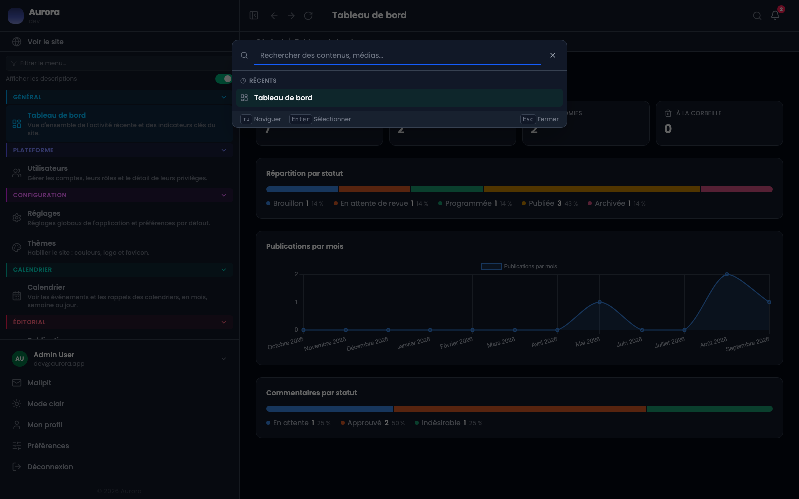
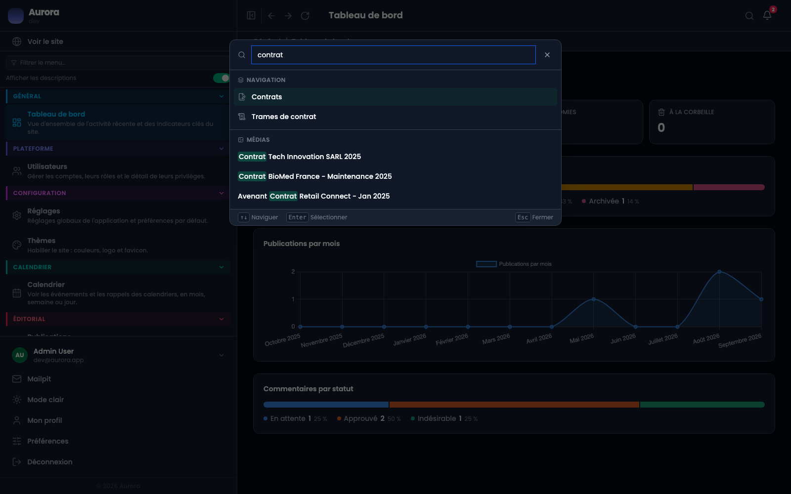
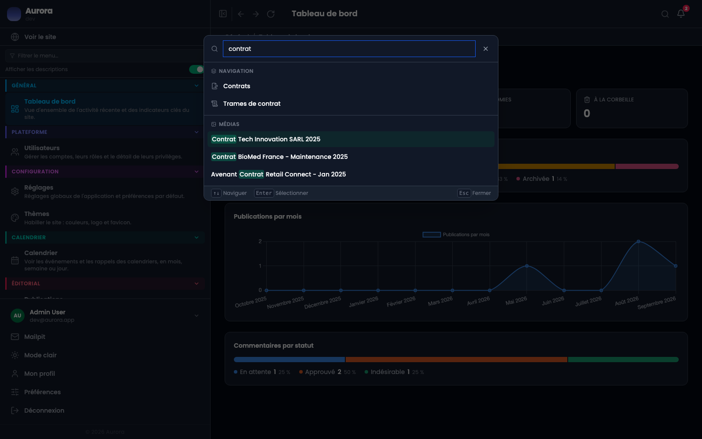

Chercher dans une administration veut d'habitude dire choisir d'abord où chercher. Ici il y a un champ, en haut à droite, et il répond depuis n'importe quel écran.

## Ouvrir et se déplacer

- Le bouton en forme de loupe, en haut à droite, à côté de la cloche. Il n'y a pas de raccourci clavier.
- Les flèches haut et bas parcourent les résultats, Entrée ouvre celui qui est surligné, Échap ferme la palette.
- Le terme cherché est surligné dans chaque résultat, ce qui dit pourquoi il est là.

## Ce que le champ traverse

- Navigation : les écrans de l'administration eux-mêmes. Taper « contrats » propose d'y aller, sans passer par le menu.
- Contenus : les publications, tous types confondus, sur leur titre comme sur le texte de leurs zones, avec leur statut et leur type affichés.
- Médias : les documents de la médiathèque, par leur nom.
- Agendas : les calendriers, leurs événements et leurs rappels.

## Ce qu'il ne traverse pas

Les notes Markdown et les clients n'ont pas de fournisseur de recherche : ils ne remontent pas ici. Chaque module branche le sien, donc en ajouter un est une modification du produit, pas un réglage.

## Ce que voit un compte

Chaque module filtre ses propres résultats. Les publications suivent les droits du compte, les agendas la visibilité de chacun, la médiathèque exige le privilège de consultation des documents, et un module éteint ne répond pas. L'accès au champ lui-même est un privilège, « utiliser la recherche globale ».

## Pourquoi c'est rapide

Le texte des publications est indexé à l'enregistrement et non parcouru à chaque frappe. Chercher dans mille pages coûte le même temps que chercher dans dix. Et si un module échoue, il rend une liste vide au lieu d'emporter le champ entier.
