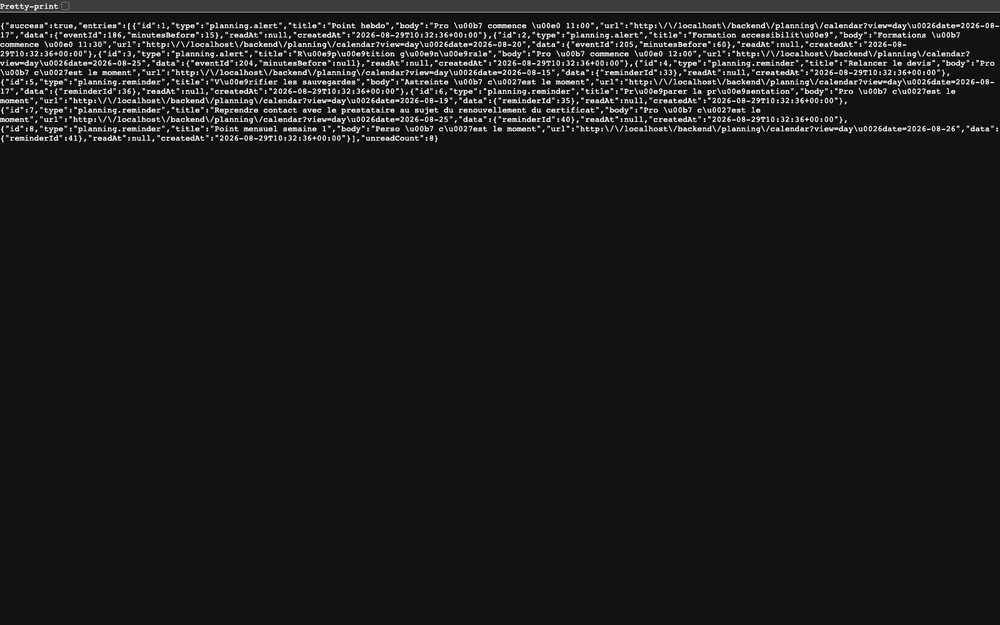

La cloche en haut à droite ne signale que ce qui demande une décision ou vous concerne personnellement. Elle n'est pas un journal d'activité : ça, c'est l'audit.

## Ce qui en déclenche une

Cinq événements, et cinq seulement :

- Une publication envoyée en relecture : l'auteur prévient les relecteurs.
- Une publication approuvée : son auteur est prévenu, avec le nom du relecteur.
- Une publication renvoyée à son auteur : idem, avec ce qu'il faut changer.
- Une invitation à un événement d'agenda.
- Une alerte d'événement, et un rappel arrivé à échéance.

## Ce qui n'en produit pas

Un commentaire reçu, une demande de formulaire, un contrat signé : rien de tout cela ne fait sonner la cloche aujourd'hui. Ces trois-là se lisent sur leur écran, et le tableau de bord en compte deux. C'est une limite connue, pas un oubli déguisé.

## Les lire

- La pastille rouge porte le nombre de non lues.
- Ouvrir une notification la marque lue et mène à l'écran concerné : la publication, l'événement.
- « Tout marquer comme lu » vide la pastille sans rien supprimer.
- Une notification se supprime, et les supprimer toutes est possible d'un geste.

## Notification ou e-mail

Les deux existent et ne servent pas à la même chose. Une alerte d'agenda choisit son canal, notification ou e-mail, événement par événement. Une notification suppose qu'on est déjà dans l'administration ; un e-mail va chercher quelqu'un qui n'y est pas.
