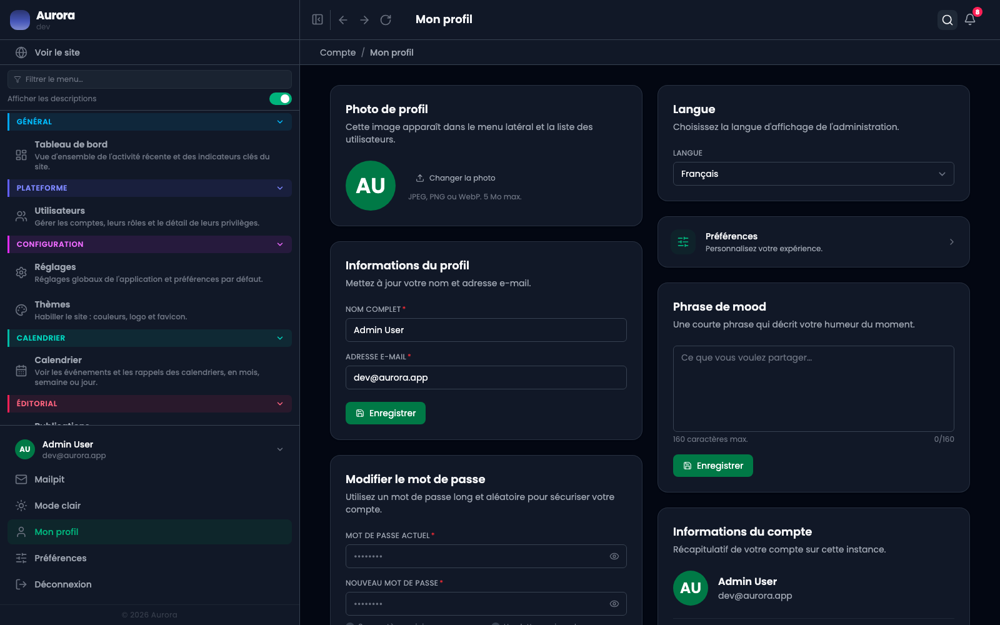

L'écran de son propre compte : ce qu'on y change vaut pour soi seul, et n'a rien à voir avec les droits, qui se règlent depuis les utilisateurs.

## Ce qui se change

- Le nom affiché, celui qui apparaît en bas du menu et à côté des publications qu'on signe.
- La photo : téléversée puis recadrée, ou supprimée pour revenir aux initiales.
- Le mot de passe, en donnant l'ancien.
- La langue de l'interface, indépendante de la langue du site.
- Un mot d'humeur, court, affiché à côté du nom.

## Ce que l'écran affiche sans le modifier

La référence du compte, son rôle et sa couleur, son type d'accès, son statut, et sa date de création. Ce sont des informations, pas des réglages : elles se changent depuis l'écran des utilisateurs, par quelqu'un qui en a le privilège.

## Supprimer son compte

Possible seulement quand le compte n'est pas le dernier à pouvoir administrer le site. Un site sans administrateur n'a plus de porte d'entrée, alors l'écran refuse plutôt que de laisser faire.
