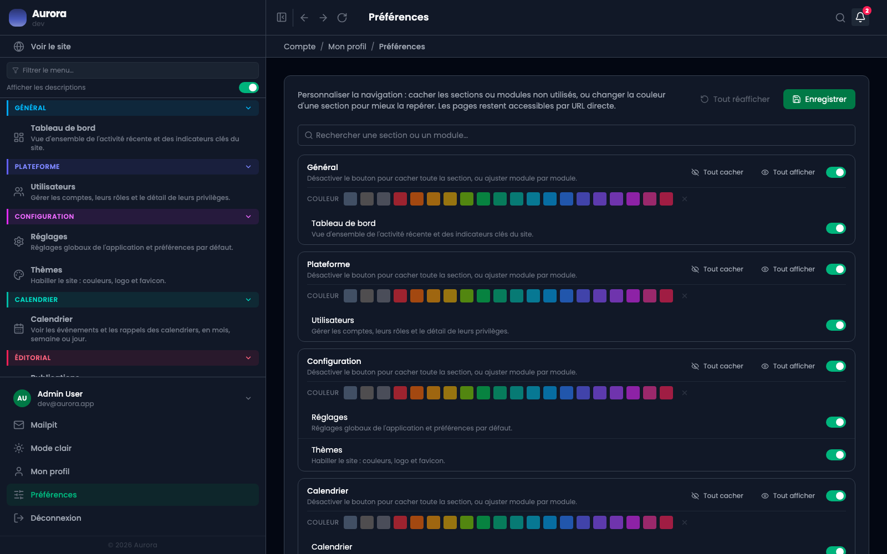

Le menu latéral se règle compte par compte. Deux personnes sur le même site peuvent avoir deux menus différents, et aucune ne modifie celui de l'autre.

L'écran s'appelle **Préférences**, sous « Mon profil ».

## Ce qui se règle ici

- Masquer une section entière, ou seulement une entrée : ce qui ne sert jamais disparaît de la vue sans être retiré à personne d'autre.
- Donner sa couleur à une section, par-dessus celle du module.
- « Tout réafficher » remet le menu à son état d'origine.

## Ce qui se règle sur le menu lui-même

Le repli, par le bouton en haut du menu, et l'affichage des descriptions sous chaque entrée, par l'interrupteur au-dessus des sections. Ces deux-là ne sont pas sur cet écran.

## Préférence ou droit

Masquer une entrée ne retire aucun droit : la page reste accessible par son adresse et par la recherche. Ce qui retire un droit, ce sont les privilèges, réglés depuis l'écran des utilisateurs. Un menu vide n'est pas une sécurité.

## Renommer, c'est ailleurs

Changer le nom d'une section pour tout le monde relève des réglages, groupe « navigation » : c'est une décision de vocabulaire pour le site, pas une préférence personnelle. Ici on choisit ce qu'on voit, pas comment ça s'appelle.

## Où c'est gardé

Sur le compte, pas dans le navigateur : le menu est le même sur un autre poste, et repli compris.
