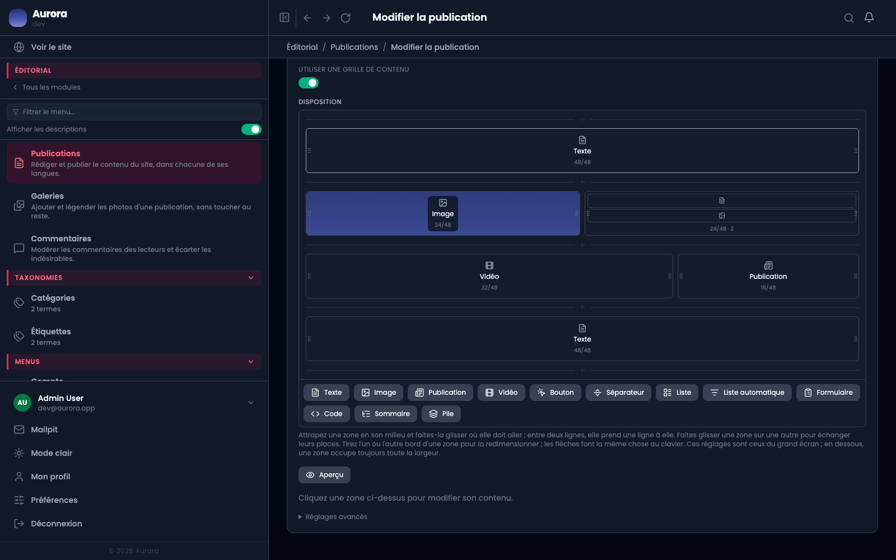

Onze types, et le bon choix se fait moins sur l'apparence que sur ce que la zone devra faire quand le contenu changera.

## Les zones de contenu écrit

- **Texte** : le cas courant, avec titres, listes, citations, tableaux, code.
- **Code** : un extrait à lire, échappé et jamais interprété.
- **Sommaire** : la table des matières de la page, construite depuis ses titres.

## Les zones qui montrent

- **Image** : une image de la bibliothèque, avec son cadrage et son ratio.
- **Vidéo** : une vidéo hébergée ou une adresse externe.
- **Séparateur** : une respiration, pas un trait décoratif.

## Les zones qui pointent ailleurs

- **Publication** : une carte vers une autre publication, choisie à la main.
- **Liste automatique** : une liste qui se tient à jour toute seule, par type ou par terme.
- **Liste** : une liste d'éléments écrits à la main, avec image et lien.
- **Bouton** : un appel à l'action.
- **Formulaire** : un formulaire du site, posé dans la page.

## La pile

**Pile** n'affiche rien par elle-même : elle contient d'autres zones et les empile verticalement. Utile pour qu'un groupe de zones se comporte comme une seule dans la grille.

## Choisir entre liste et liste automatique

Si le contenu doit rester tel quel dans six mois, une liste écrite à la main. S'il doit refléter ce qui existe alors, une liste automatique. C'est la seule question à se poser.
