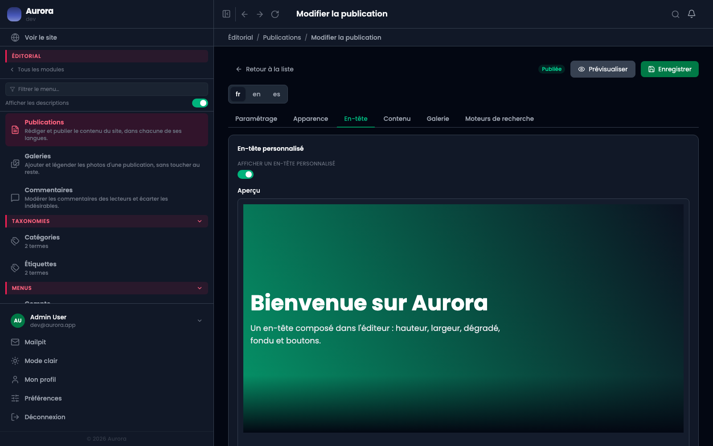
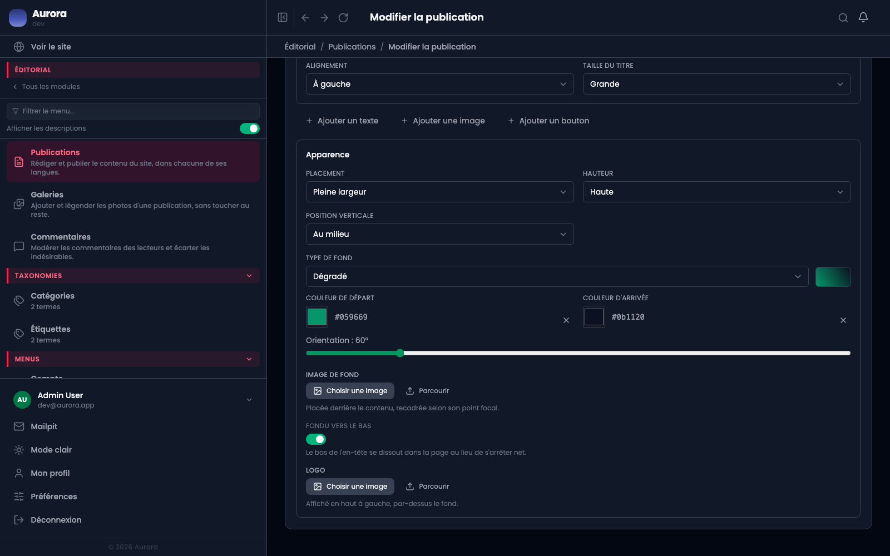

L'en-tête est la bande du haut d'une page. Il est facultatif : sans lui, la page commence par son titre et son résumé.

## La forme

Hauteur, largeur et alignement du contenu. Une hauteur fixe se remplit vite quand la fenêtre rétrécit : c'est le premier endroit à vérifier sur téléphone.

## Le fond

- Une **couleur**.
- Un **dégradé**, dont on choisit l'angle.
- Une **image**, avec un assombrissement réglable pour que le texte reste lisible par-dessus.
- Un **fondu vers le bas**, qui raccorde l'en-tête au fond de la page.

## Les éléments empilés

L'en-tête peut porter un titre, un sous-titre, un bouton, un logo. Quand il porte un titre, celui de l'onglet Paramétrage n'est plus affiché en tête de page : les deux ne se cumulent pas.

