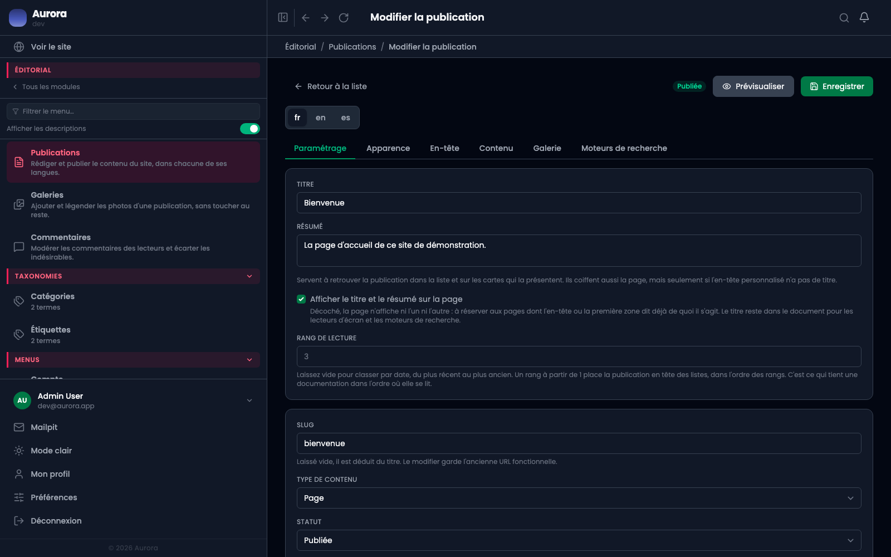
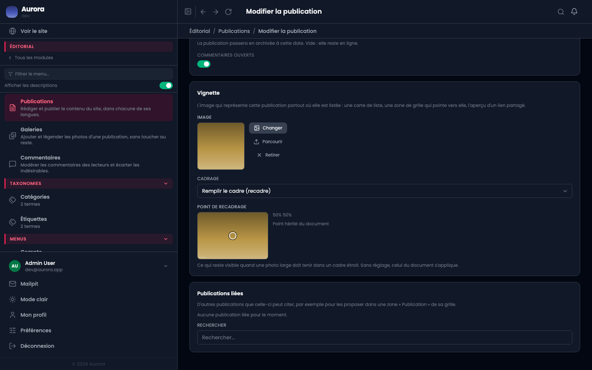

L'onglet où une publication dit ce qu'elle est. C'est celui qui s'ouvre en premier, et le seul dont tous les champs comptent quel que soit le type de contenu.

## Le titre et le résumé

Ils servent d'abord à retrouver la publication dans la liste et sur les cartes qui la présentent. Ils coiffent aussi la page, **mais seulement si l'en-tête personnalisé n'a pas de titre**.

La case « afficher le titre et le résumé » se décoche pour les pages dont l'en-tête ou la première zone dit déjà de quoi il s'agit. Le titre reste alors dans le document, pour les lecteurs d'écran et les moteurs.

## L'adresse

Laissée vide, elle est déduite du titre. La modifier garde l'ancienne adresse fonctionnelle : Aurora conserve l'historique et redirige, ce qui évite de casser les liens déjà partagés.

## Le reste

- **Type de contenu** : il décide de la forme de l'adresse publique et des taxonomies disponibles.
- **Statut** et **dates** : la mise en ligne et la dépublication programmées.
- **Auteur**, **termes**, **publications liées**.
- **Commentaires ouverts** : la case qui les autorise sur cette publication.

