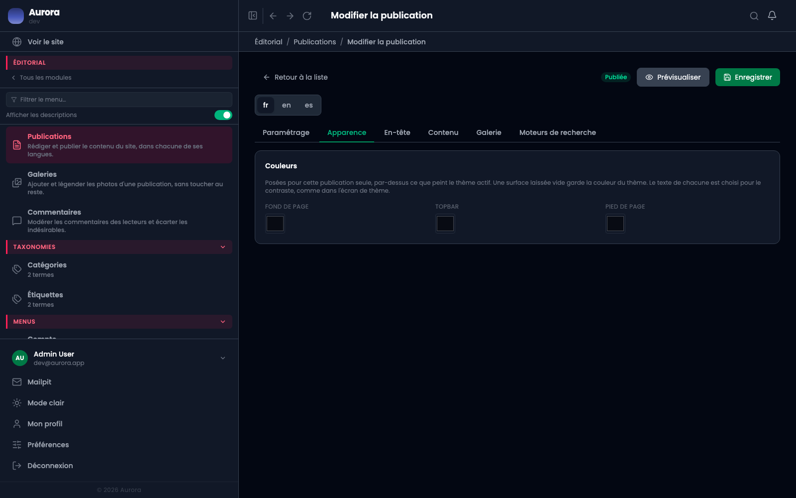

Cet onglet permet à une publication de s'écarter du thème, pour elle seule.

## Repeindre

L'en-tête, le pied et le fond de cette publication peuvent prendre d'autres couleurs que celles du thème. Utile pour une page de campagne, un dossier spécial, une landing.

Attention au contraste : les couleurs du thème sont calculées pour rester lisibles en clair comme en sombre. Une couleur forcée ici échappe à ce calcul, et doit être vérifiée dans les deux modes.

## La vignette

C'est l'image qui représente la publication ailleurs : dans les listes, sur les cartes, dans une zone « publication ». Elle se choisit dans la bibliothèque.

Son **cadrage** et son **point d'intérêt** se règlent ici : le point d'intérêt dit quelle partie de l'image doit rester visible quand le cadre est plus étroit que l'image. Sur un portrait, c'est le visage.

