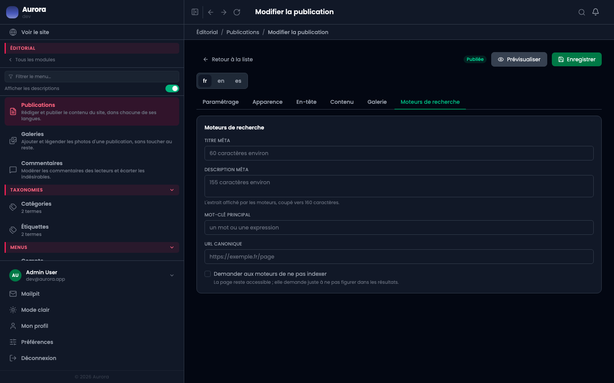

Ce que les moteurs et les réseaux sociaux liront de cette page. Rien n'est obligatoire : sans réglage, les valeurs par défaut du site s'appliquent.

## Titre et description

Les deux affichent leur compte de caractères, parce que les moteurs coupent au-delà d'une certaine longueur. Le compteur est une indication, pas une limite.

## Les réglages qui comptent quand ils sont là

- **URL canonique** : à remplir quand le même contenu existe à une autre adresse qui doit faire foi.
- **Désindexation** : la page reste accessible mais demande à ne pas être indexée.
- **Image de partage** : celle qui apparaît quand le lien est collé sur un réseau social.
- **Données structurées** : le JSON-LD que la page portera.

## Ce qui se fait tout seul

Les balises Open Graph et Twitter, les liens entre les langues, l'entrée dans le sitemap et l'en-tête de cache calculé sur la date du contenu. Il n'y a rien à cocher pour ça.

