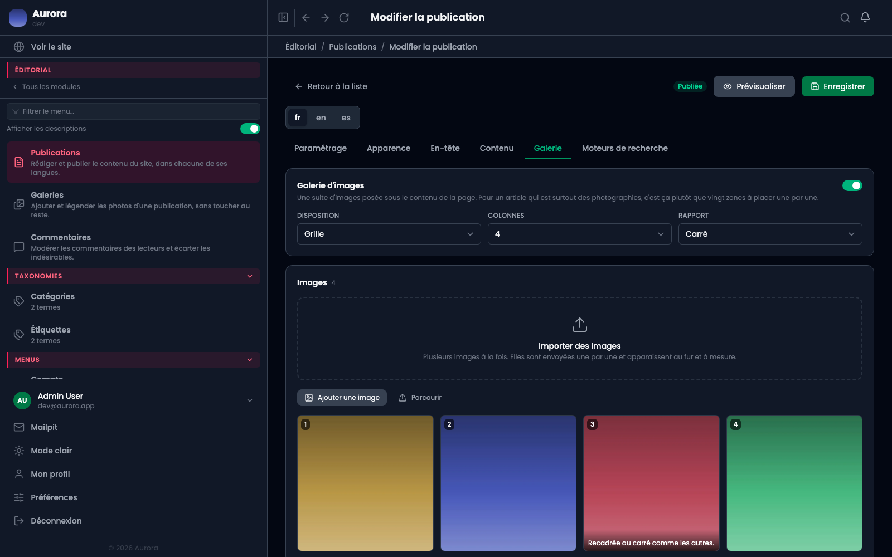
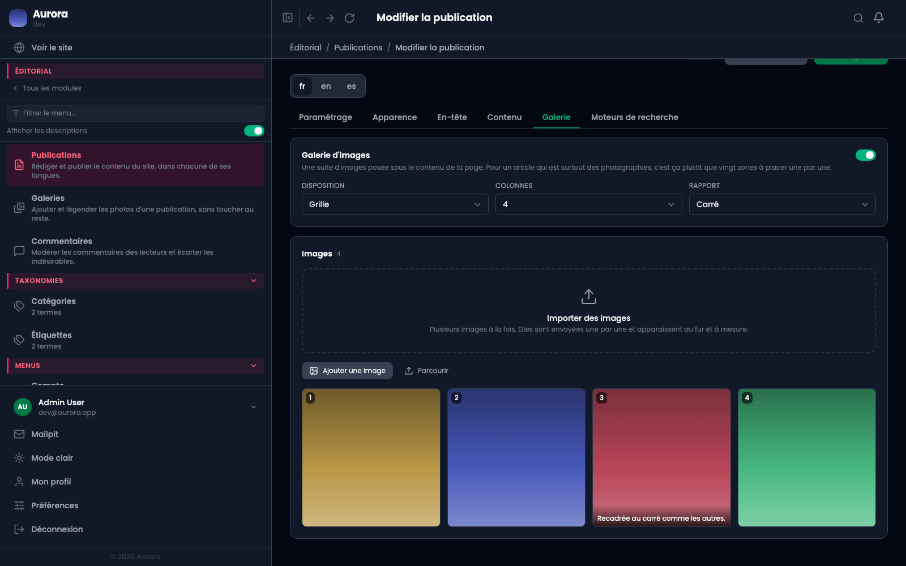

Une galerie s'affiche après le contenu de la page. C'est une série de photos, pas une zone de la grille : elle vit à part et se gère ici.

## Ajouter et ordonner

Les photos viennent de la bibliothèque. L'ordre se change par glissement, et c'est celui que le visiteur verra.

## Légender

Chaque photo peut porter une légende, affichée sous elle et reprise dans la visionneuse. Le texte alternatif, lui, se règle dans la bibliothèque : il décrit l'image, la légende la commente. Ce ne sont pas les mêmes phrases.

## Grille ou mosaïque

La **grille** donne des vignettes de taille égale, la **mosaïque** respecte les proportions de chaque photo. La mosaïque va mieux à des formats mélangés, la grille à une série homogène.

