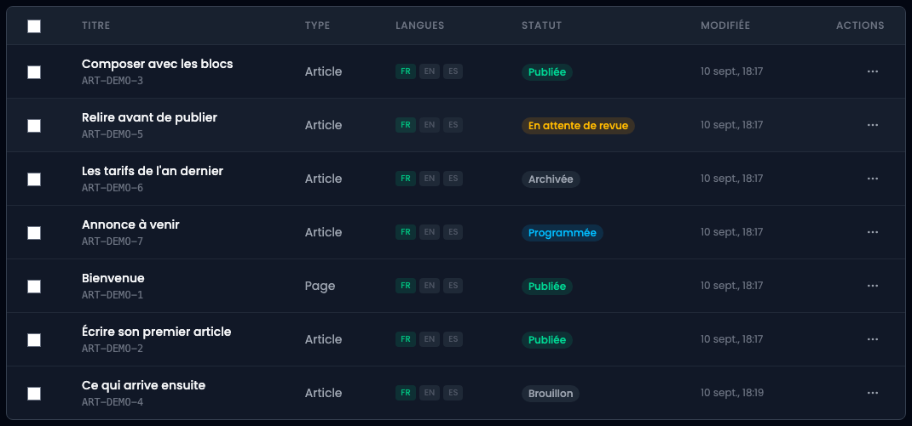
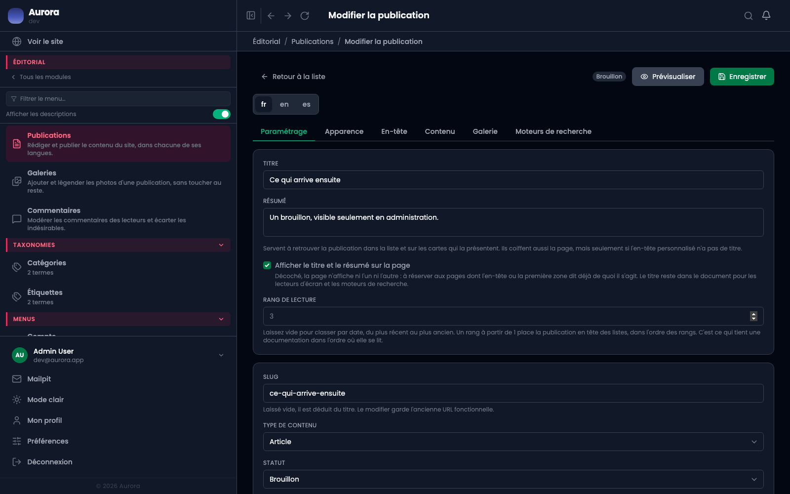
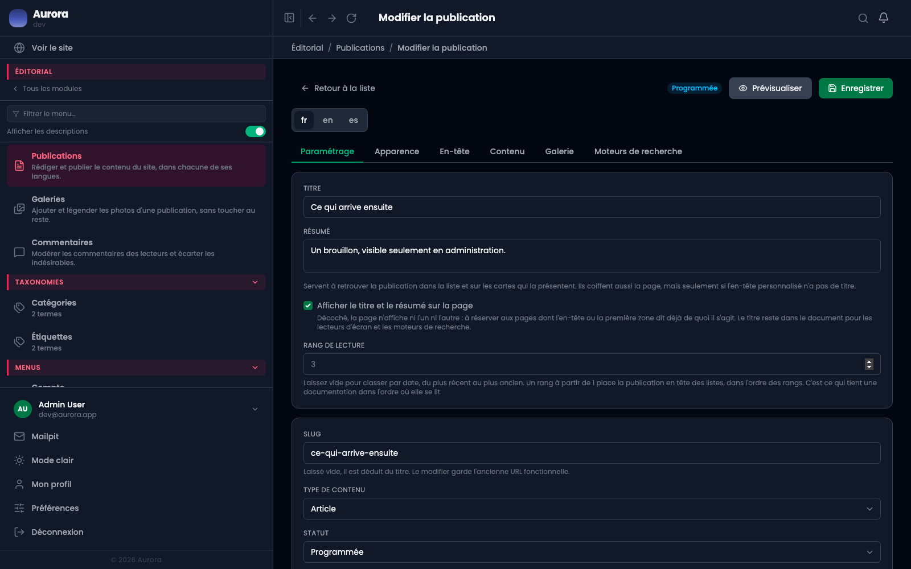
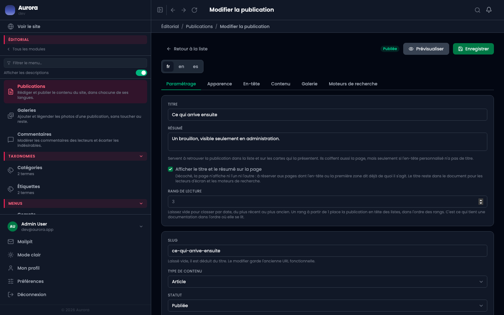

Une publication traverse des états, et chacun sert à quelque chose. Aucun n'oblige à faire attention : c'est le mécanisme qui empêche la sortie prématurée, pas la vigilance.

## 1. Le statut se lit dans la liste

La colonne **Statut** dit où en est chaque publication, sans avoir à l'ouvrir. Les filtres au-dessus de la liste reprennent les mêmes cinq états.

- **Brouillon** : invisible du site, modifiable.
- **En attente de revue** : envoyée à un relecteur, qui approuve ou renvoie avec ce qu'il faut changer. Les deux préviennent l'auteur.
- **Programmée** : une date de mise en ligne est posée, et la publication sort toute seule.
- **Publiée** : en ligne.
- **Archivée** : retirée du site sans être supprimée.

## 2. Le statut reste visible pendant l'écriture

Dans l'éditeur, la pastille est en haut à droite, à côté d'**Enregistrer**. Elle ne bouge pas quand on change d'onglet : savoir qu'on est en train de modifier une page en ligne ne devrait pas demander d'aller le vérifier.

## 3. Changer de statut

Le choix se fait dans l'onglet **Paramétrage**, sous l'adresse et le type de contenu. C'est le même menu pour les cinq états.

## 4. La date de mise en ligne

Choisir **Programmée** fait apparaître **Publier le**. À l'heure dite, la publication passe en ligne d'elle-même : personne n'a à être devant l'écran.

La sortie est automatique. Si une publication programmée n'est pas sortie à l'heure dite, il n'y a rien à corriger dessus : la mise en ligne automatique est en panne, et c'est à signaler.

## 5. La date de retrait

**Dépublier le** ne dépend d'aucun statut : c'est la date à laquelle une page en ligne passera en archivée. Laissée vide, la page reste.

Elle évite d'avoir à penser à ce qui ne doit pas rester : une promotion, une offre d'emploi, une annonce datée.

