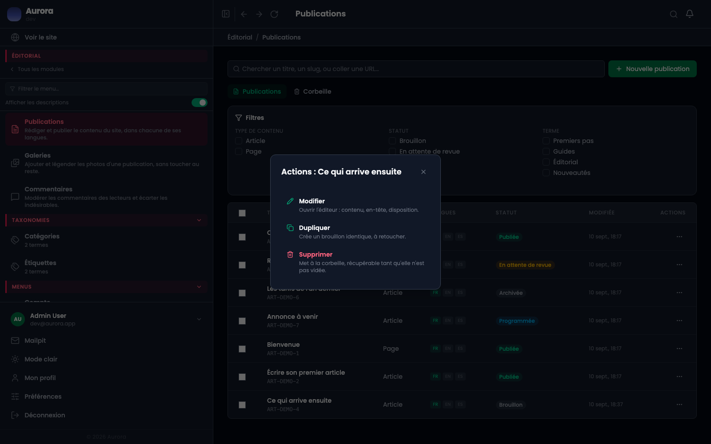
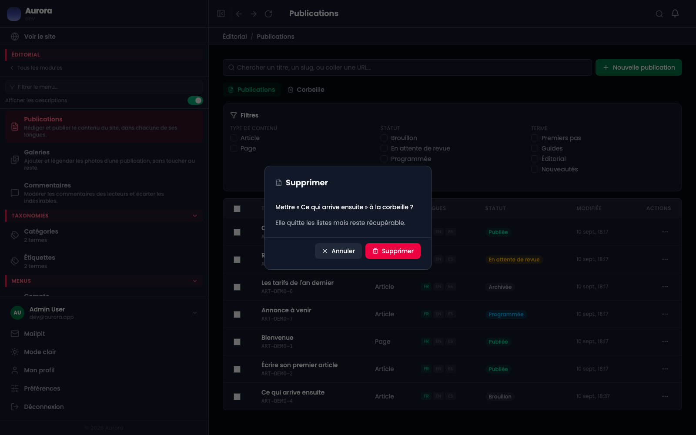
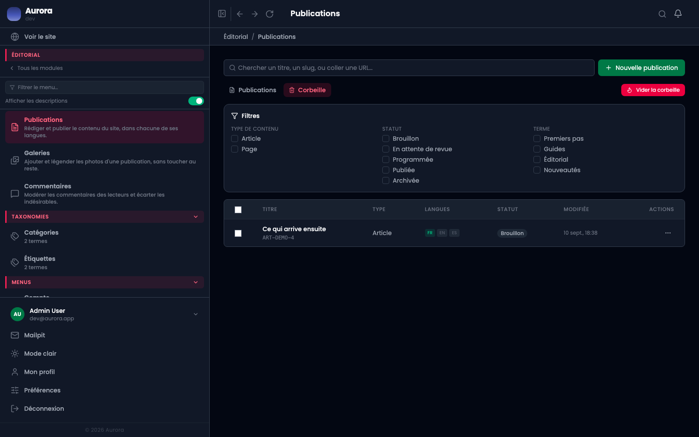
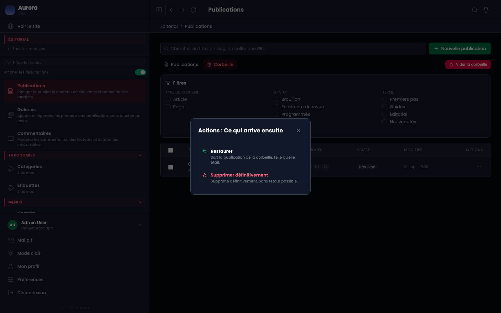
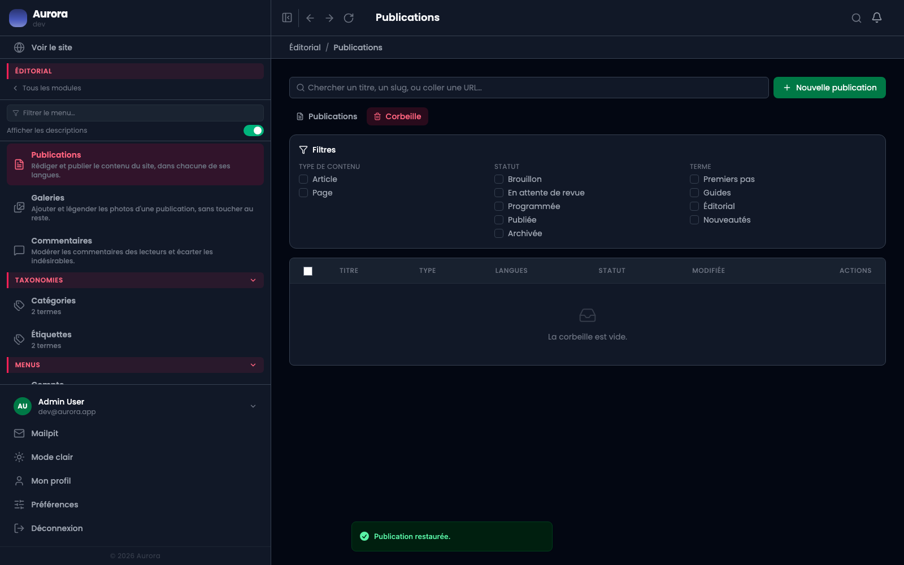

Une publication mise à la corbeille quitte le site sans quitter la base. Elle se restaure, ou s'efface pour de bon.

## 1. Mettre à la corbeille

Le menu d'une ligne, à droite dans la liste, propose **Dupliquer** et **Supprimer**. Le second n'efface pas : il met à la corbeille, et le texte sous l'action le dit.

## 2. La confirmation

La fenêtre nomme la publication et rappelle ce qui va lui arriver : elle quitte les listes, elle reste récupérable.

## 3. L'onglet Corbeille

À côté de **Publications**, l'onglet **Corbeille** montre ce qui y a été mis. Les filtres et la recherche y fonctionnent comme dans la liste normale.

**Vider la corbeille**, en haut à droite, efface tout d'un coup. La purge automatique s'en charge aussi, au bout de trente jours par défaut.

## 4. Restaurer, ou effacer pour de bon

Le menu d'une ligne de la corbeille offre les deux : **Restaurer** remet la publication dans le statut qu'elle avait, **Supprimer définitivement** ne se rattrape pas.

## 5. Ce que la corbeille ne couvre pas

Uniquement les publications. Un document de la médiathèque, un événement, un formulaire : supprimés, ils sont supprimés. Le compteur du tableau de bord ne parle donc que des pages.

