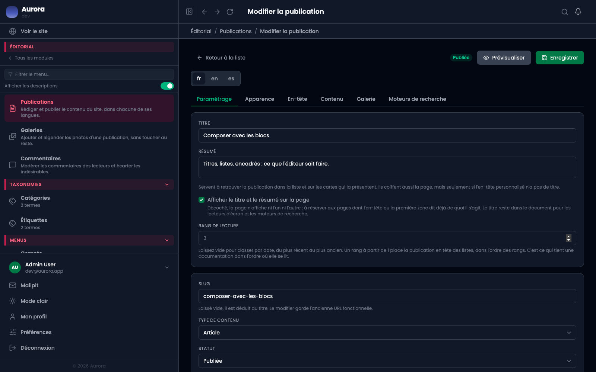
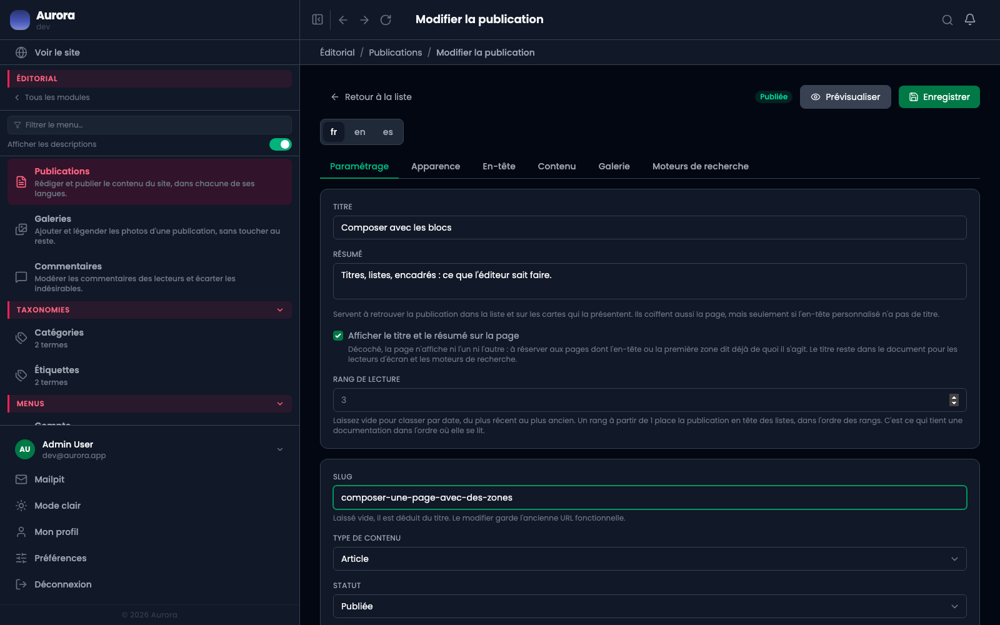
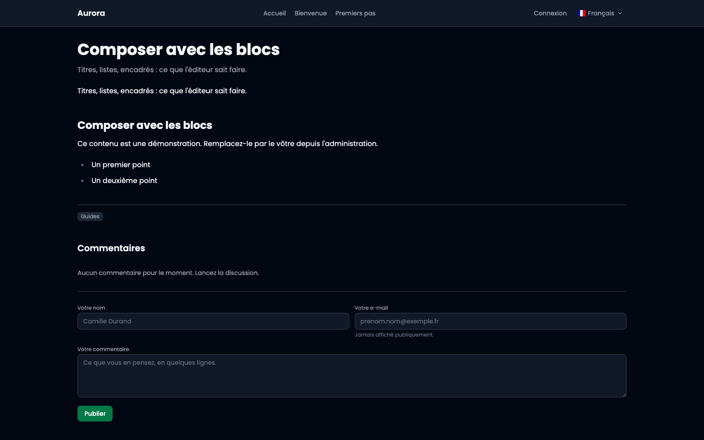

Changer l'adresse d'une publication n'abandonne pas l'ancienne : elle continue de répondre, et renvoie vers la nouvelle.

## 1. Le champ Slug

Il est dans l'onglet **Paramétrage**, sous le titre. Laissé vide, il se déduit du titre ; c'est lui qui forme la fin de l'adresse publique.

Le slug appartient à la langue : renommer la version française ne touche pas à l'anglaise, et chacune garde son historique.

## 2. Renommer

On écrit la nouvelle adresse, on enregistre. Le changement est enregistré au passage : l'ancienne adresse est retenue, avec la langue à laquelle elle appartenait.

## 3. L'ancienne adresse répond toujours

Un lien partagé avant le renommage continue de fonctionner : l'ancienne adresse répond par une redirection permanente vers la nouvelle, et le visiteur voit la page. Les moteurs suivent la redirection et transfèrent ce que la page avait gagné.

Une réserve à connaître : une adresse libérée par un renommage peut être reprise par une autre page du même type. Dans ce cas la nouvelle page gagne et la redirection cesse. C'est voulu, mais il vaut mieux le savoir avant de recycler une adresse.

