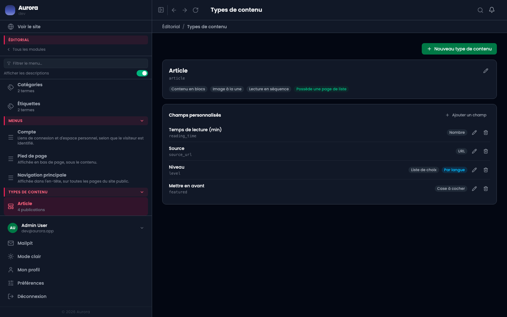

Un type de contenu est une famille de publications. Page et article existent d'origine ; les autres se créent ici, et c'est ainsi qu'est né le type « documentation » que vous lisez.

## La liste

Chaque type montre son adresse, s'il a une archive, et ce qu'il supporte. L'écran s'ouvre directement sur le premier type : il n'y a pas de page de liste séparée.

## Les réglages d'un type

- Le **nom**, au singulier, et le nom d'archive au pluriel.
- L'**adresse**, qui devient le premier segment de l'URL publique de ses publications.
- **A une archive** : si oui, l'adresse liste toutes ses publications ; sinon elle ne mène nulle part.
- Les **supports** : contenu en blocs, image à la une, lecture en séquence.

« Lecture en séquence » est ce qui donne à un type son sommaire et ses liens précédent/suivant. C'est coché pour la documentation, décoché pour un blog.

## Une précaution sur l'adresse

L'adresse d'un type entre dans les URL de toutes ses publications. La changer casse les liens existants, et contrairement au renommage d'une publication, aucun historique ne rattrape le coup. À décider avant de publier, pas après.
