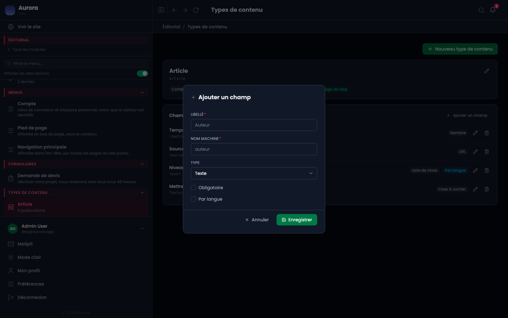

Un type peut demander des informations que le contenu en blocs ne porte pas : une date d'événement, un prix, un lien de réservation.

## Les huit types

- **Texte** et **texte long**.
- **Nombre** et **date**.
- **Liste** de choix et **case à cocher**.
- **Lien** et **e-mail**, validés comme tels.

## Ajouter un champ

Un libellé, un nom machine, un type, et les deux cases qui comptent.

## Obligatoire ou non

Un champ obligatoire empêche l'enregistrement tant qu'il est vide. À réserver à ce qui est vraiment indispensable : un champ obligatoire ajouté après coup rend soudain invalides toutes les publications existantes.

## « Par langue »

La question la plus importante des deux. Un champ **par langue** a une valeur dans chacune : un sous-titre se traduit. Un champ qui ne la suit pas a une seule valeur partagée : un prix, une date, une référence.

Se tromper ici se paie plus tard : passer un champ traduit en champ partagé oblige à choisir laquelle des valeurs survit.
