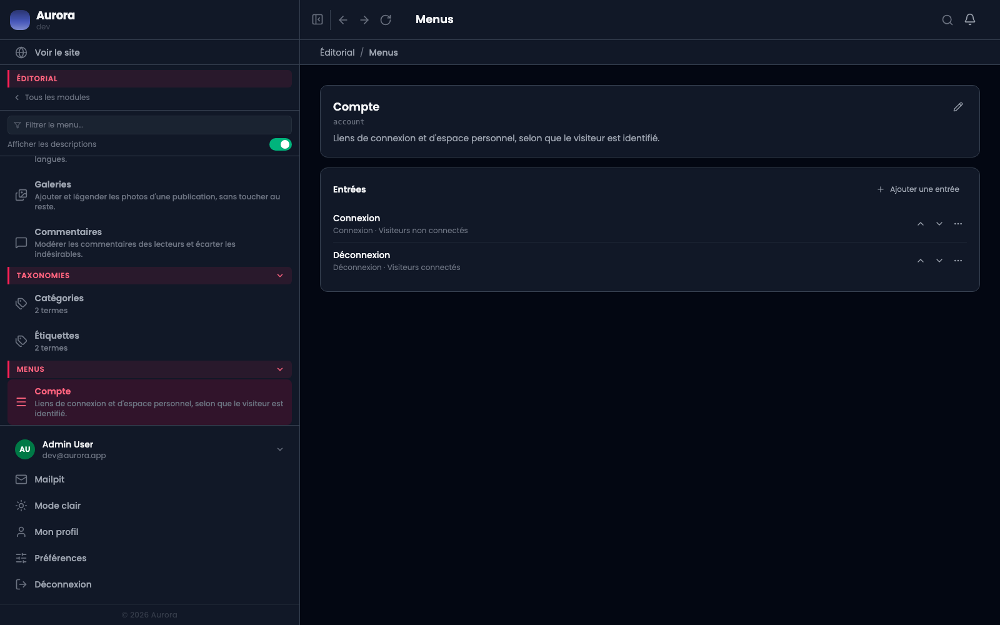

Trois menus existent, un par emplacement : l'en-tête, le pied de page, et le menu du compte. On ne peut pas en créer un quatrième, parce qu'il n'y aurait nulle part où l'afficher.

## Composer un menu

Les entrées s'ajoutent, se réordonnent par glissement, et s'imbriquent sur un niveau pour former un sous-menu.

## Ce qu'une entrée porte

- Un **libellé**, par langue.
- Une **cible**, décrite dans sa propre page.
- Une **visibilité**, décrite aussi à part.
- Éventuellement des **enfants**.

## Les trois emplacements ne se ressemblent pas

Le menu d'en-tête est le seul à afficher des sous-menus. Le pied de page les aplatit. Le menu du compte ne s'affiche qu'aux visiteurs identifiés, quelle que soit la visibilité réglée sur ses entrées.

