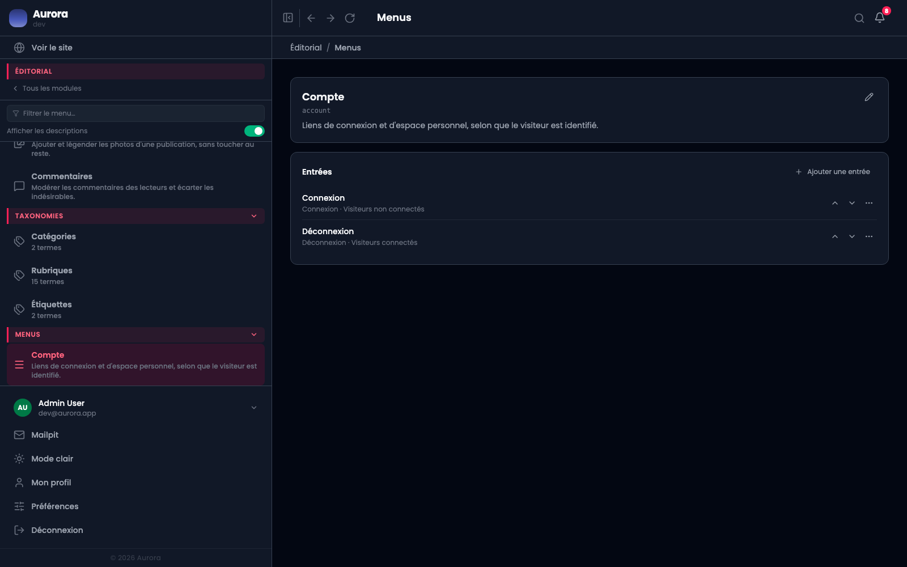

Une entrée pointe sur quelque chose que le site connaît, ce qui lui évite de casser quand la chose change d'adresse.

## Les cibles de contenu

- Une publication précise.
- Un terme de taxonomie.
- La page d'archive d'un type de contenu.
- L'accueil.
- Une adresse extérieure, ou une ancre dans la page.

## Les cibles de compte

Connexion, inscription, espace personnel, déconnexion. Elles s'affichent selon que le visiteur est identifié ou non, ce qui se règle par la visibilité de l'entrée.
