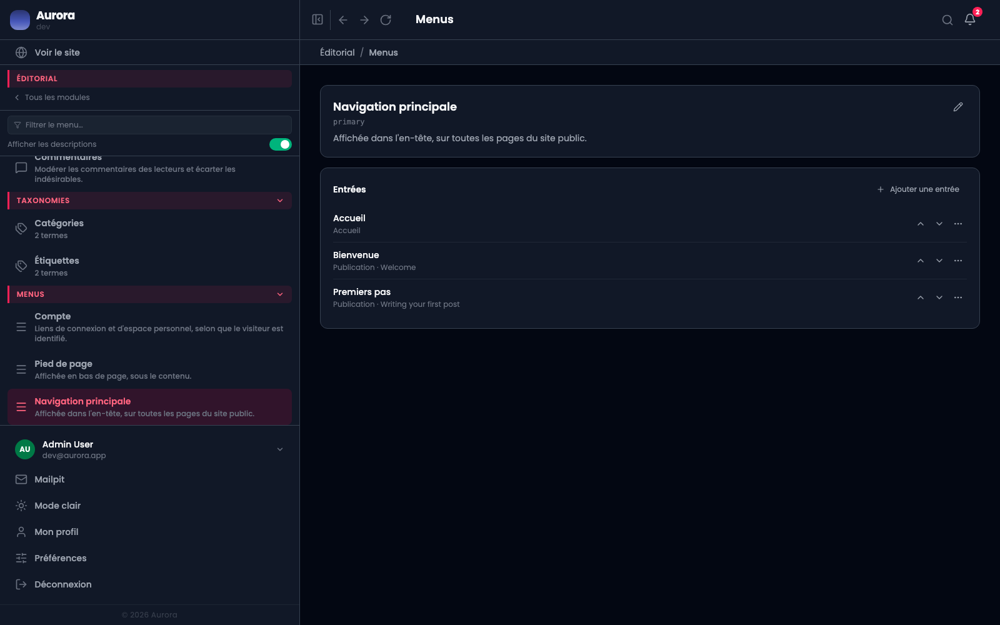
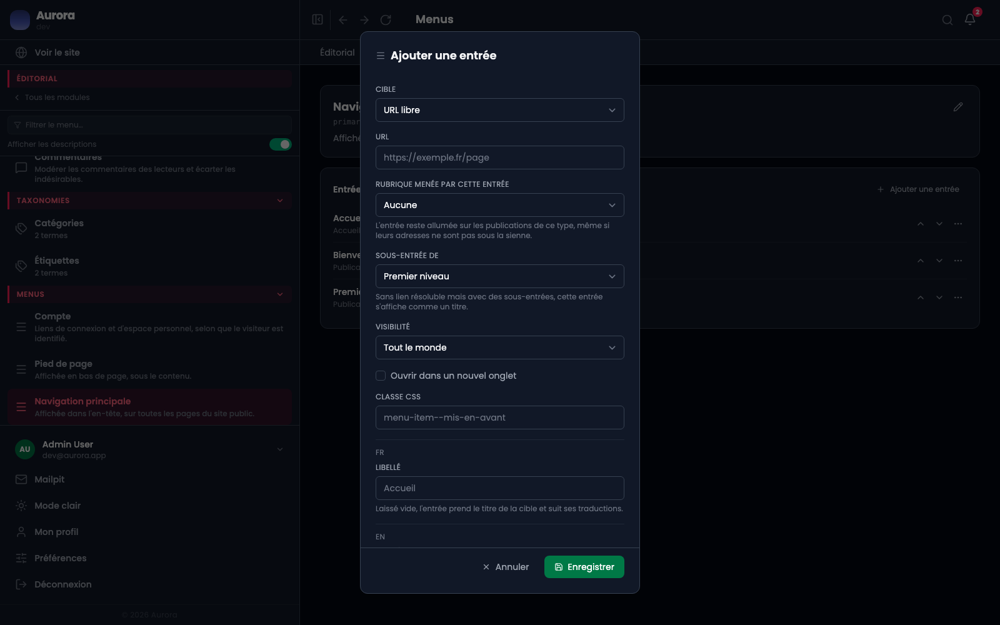

Une entrée pointe sur quelque chose que le site connaît, ce qui lui évite de casser quand la chose change d'adresse.

## Le menu et ses entrées

Chaque menu a son emplacement : la navigation principale s'affiche dans l'en-tête, le pied de page en bas, le menu Compte porte les liens de connexion. Les flèches montent et descendent une entrée.

## La cible

C'est le premier champ de l'entrée, et il commande le reste : choisir « Publication » demande quelle publication, choisir « URL libre » demande l'adresse.

## Les cibles de contenu

- **Publication** : une publication précise.
- **Terme** : un terme de taxonomie, donc sa page de liste.
- **Liste d'un type de contenu** : la page d'archive du type.
- **Accueil**.
- **URL libre** : une adresse extérieure, ou une ancre.

Les quatre premières suivent leur cible : renommer la publication renomme l'entrée, changer son adresse change le lien. « URL libre » ne suit rien, et c'est la seule qui puisse pointer dans le vide.

## Les cibles de compte

Connexion, Inscription, Mon compte, Déconnexion. Elles s'affichent selon que le visiteur est identifié ou non, ce qui se règle par la **visibilité** de l'entrée.

## Trois champs qui aident

- **Rubrique menée par cette entrée** : l'entrée reste allumée sur les publications de ce type, même si leurs adresses ne sont pas sous la sienne.
- **Sous-entrée de** : range l'entrée sous une autre. Une entrée sans lien résoluble mais avec des sous-entrées s'affiche comme un titre.
- **Libellé** : laissé vide, l'entrée prend le titre de sa cible et suit ses traductions.
