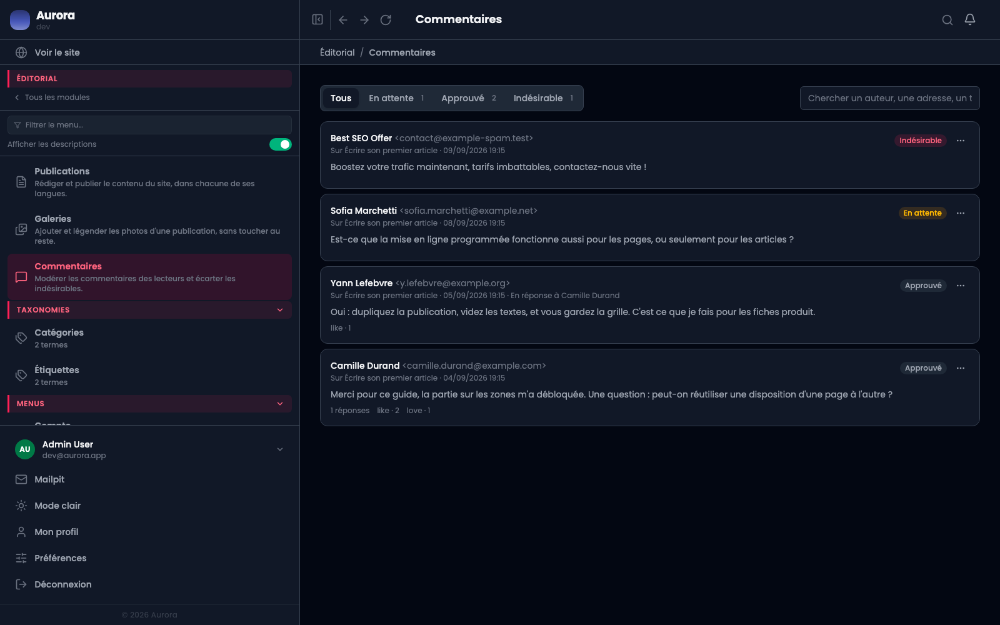
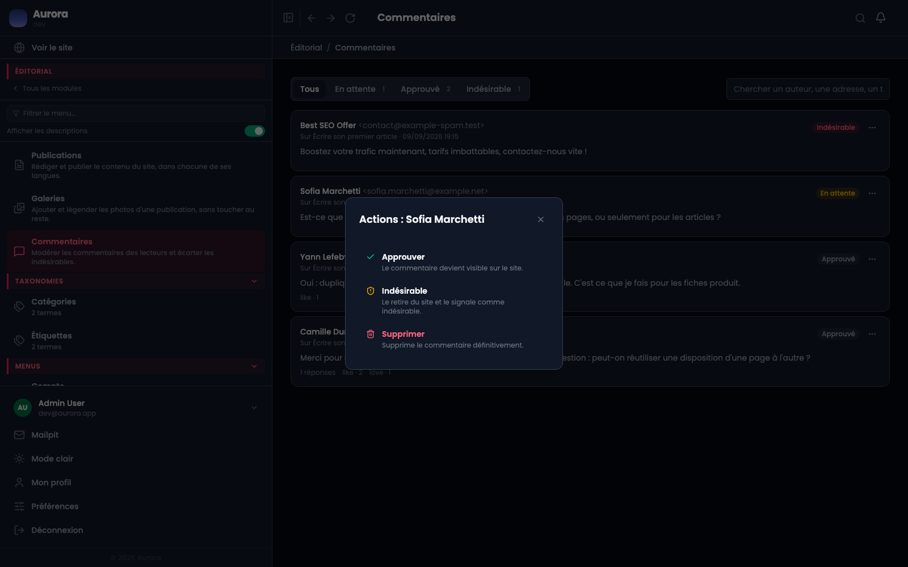
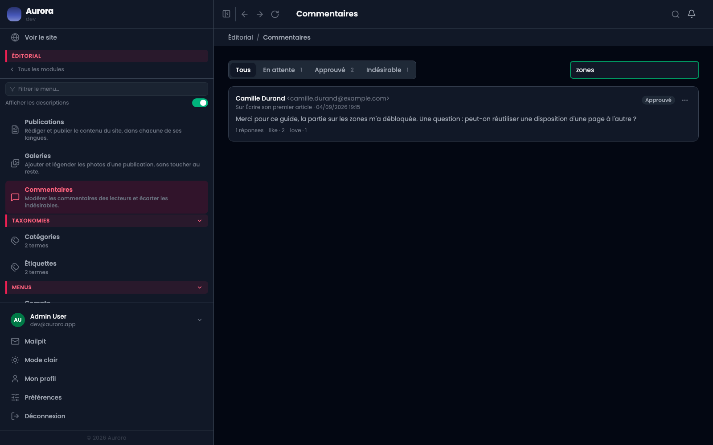
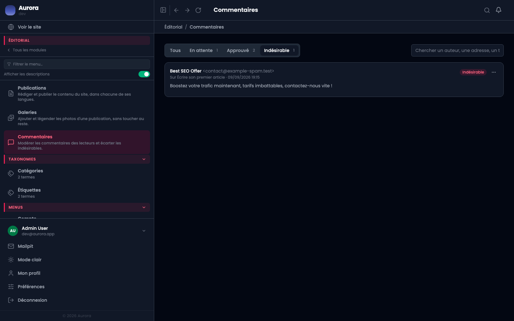

Les commentaires arrivent ici, et rien n'apparaît sur le site tant que vous n'avez pas tranché, si la modération est active.

## 1. La file

Un écran, une liste, la plus récente en haut. Chaque ligne donne l'auteur et son adresse, la publication commentée, la date, l'état, et le texte en entier : la modération se fait en lisant, pas en ouvrant.

Une réponse porte la mention **En réponse à** suivie du nom : le fil se lit sans avoir à le déplier.

## 2. Les trois états

- **En attente** : reçu, invisible sur le site.
- **Approuvé** : visible.
- **Indésirable** : conservé ici, jamais affiché.

Les onglets portent leur compte, ce qui suffit à savoir s'il y a quelque chose à faire avant même de lire. Un commentaire indésirable n'est pas supprimé, et c'est délibéré : savoir qu'un message a été reçu et écarté vaut mieux que de l'avoir perdu.

## 3. Trancher

Le menu d'une ligne offre les trois gestes, avec ce qu'ils font écrit dessous : **Approuver** le rend visible, **Indésirable** le retire et le signale, **Supprimer** l'efface définitivement.

Approuver une réponse dont le parent est en attente ne la fait pas apparaître : elle n'aurait rien à quoi se rattacher.

## 4. Chercher

La recherche porte sur l'auteur, l'adresse e-mail et le texte. C'est ce qu'il faut pour retrouver un message dont on se souvient d'un mot, ou pour rassembler tout ce qu'une même adresse a envoyé.

## 5. Fermer les commentaires

Sur une publication : une case dans l'onglet **Paramétrage**. Pour tout le site : deux réglages dans **Lecture**, autoriser les commentaires et les modérer avant publication.

Fermer les commentaires d'une publication n'efface pas ceux déjà reçus : ils restent visibles, seul le formulaire disparaît.

