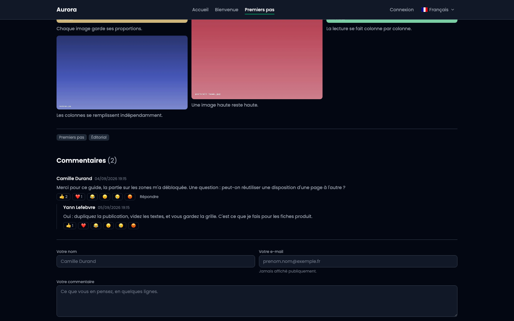
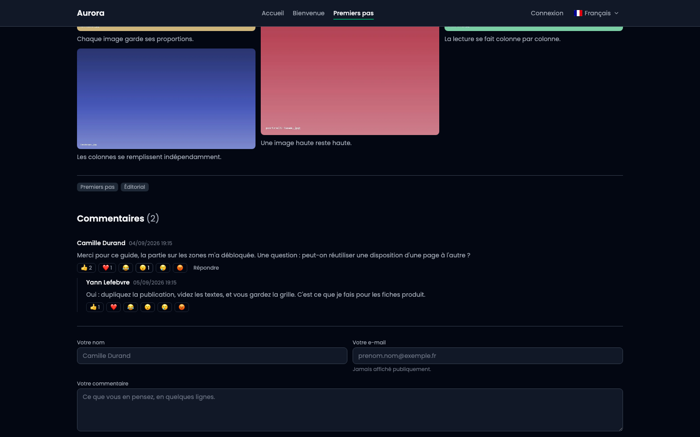
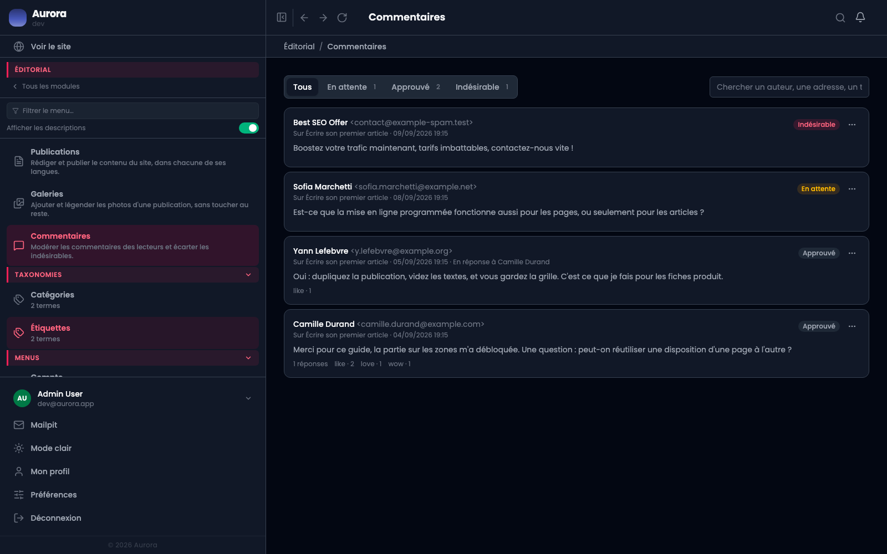

Sous chaque commentaire, six réactions. C'est la version courte du commentaire, et elle n'a pas besoin de modération.

## 1. Sous les commentaires du site

Elles n'existent que là où les commentaires sont ouverts, et elles s'affichent avec eux : sous le commentaire, sous chaque réponse.

## 2. Les six

J'aime, j'adore, drôle, étonnant, triste, en colère. Celles qui ont été choisies portent leur compte ; les autres attendent, en gris.

Une réaction par personne et par commentaire. La reposer l'annule : c'est le même bouton qui met et qui retire.

## 3. Réagir

Un clic, et le compte bouge. Rien à valider, aucun compte à créer : le visiteur est reconnu par une empreinte de son navigateur, ce qui suffit à l'empêcher de voter deux fois sans l'obliger à s'identifier.

## 4. Côté modération

Les réactions apparaissent sous chaque commentaire dans la file, en clair : `like · 2`. Elles ne se modèrent pas, il n'y a rien à lire, mais elles se voient : ça aide à repérer un message qui fait réagir.

