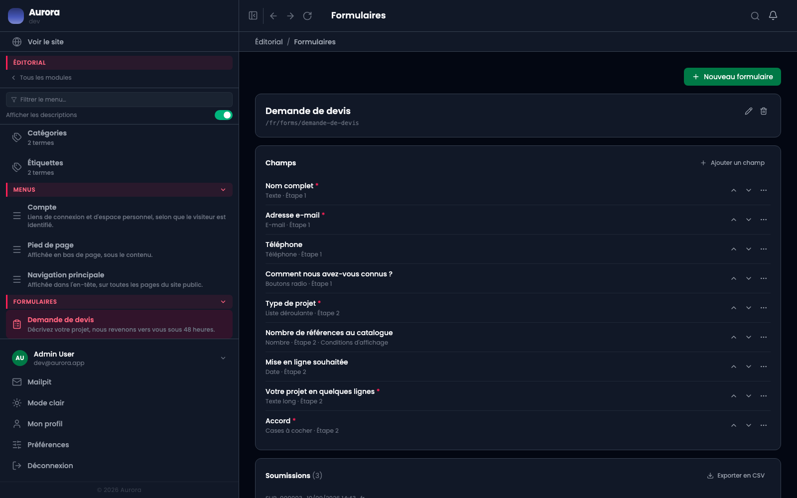
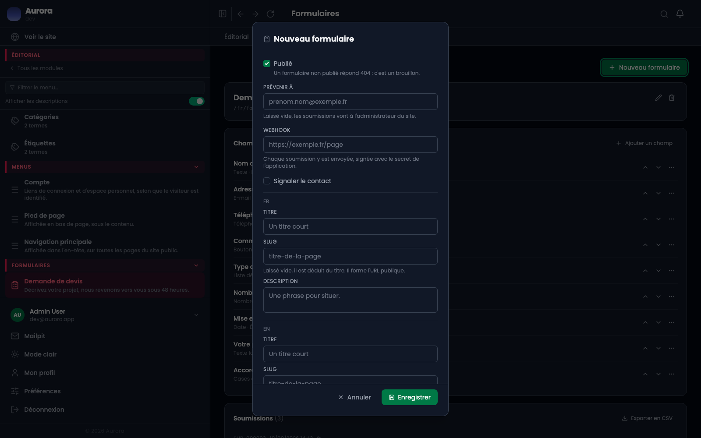
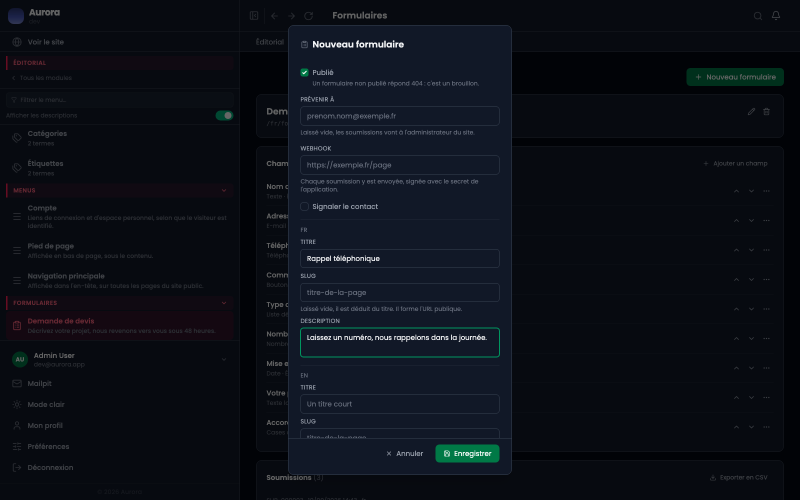
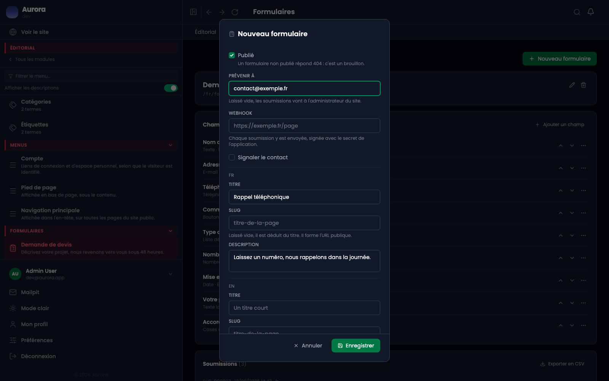
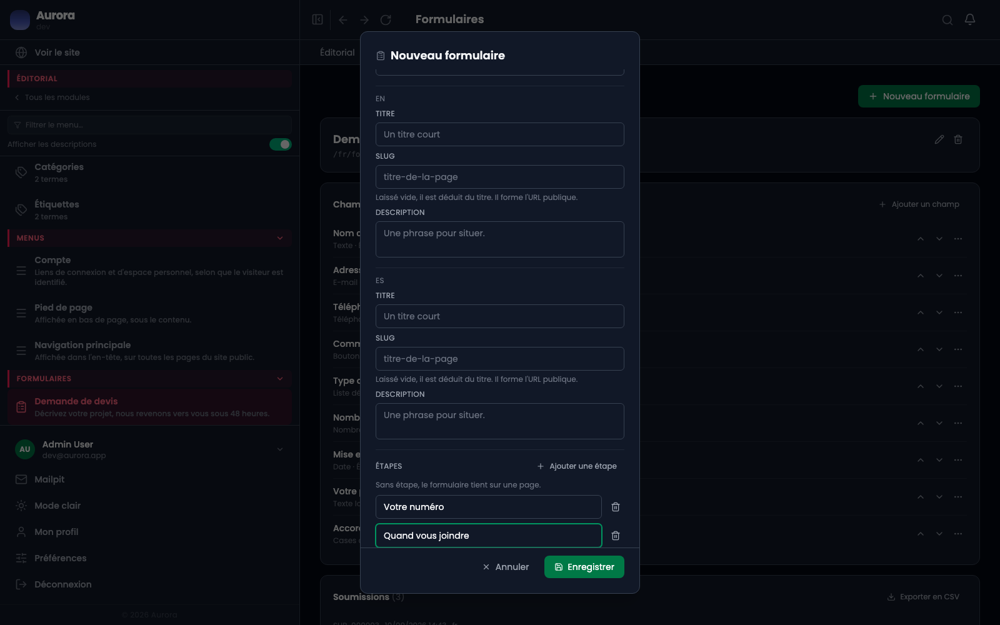
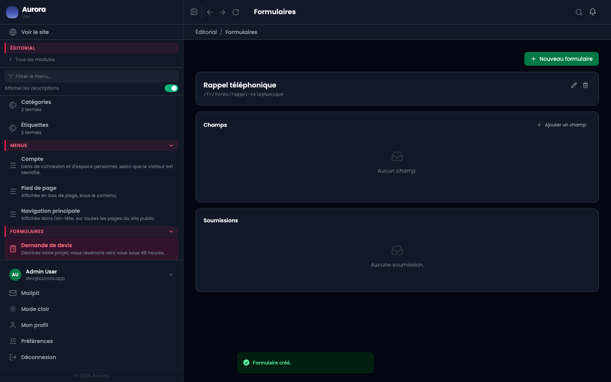

Un formulaire vit à sa propre adresse sur le site public. On le crée ici, on lui ajoute des champs, et le visiteur le remplit sans qu'aucune page n'ait besoin d'exister pour lui.

## 1. L'écran d'un formulaire

Chaque formulaire a sa ligne dans le menu latéral, et son propre écran. En haut, son titre et son **adresse publique** ; au milieu, ses champs dans l'ordre où le visiteur les rencontre ; en bas, les demandes reçues.

La mention sous chaque champ résume ce qu'il est : son type, l'étape où il se trouve, et le fait qu'il soit conditionné.

## 2. Nouveau formulaire

Le bouton **Nouveau formulaire** ouvre une fenêtre qui contient tout le formulaire sauf ses champs : ce qu'il est, qui prévenir, et son découpage.

Le premier réglage est **Publié**. Un formulaire non publié répond 404 sur le site : c'est un brouillon, pas un formulaire fermé.

## 3. Le titre, dans chaque langue

Le titre et la description sont écrits par langue. Le **slug** laissé vide se déduit du titre, et c'est lui qui forme l'adresse : `/fr/forms/mon-formulaire`.

Une langue dont le titre reste vide n'a pas de formulaire : l'adresse n'existe pas dans cette langue.

## 4. Qui reçoit les réponses

**Prévenir à** est l'adresse qui reçoit un e-mail à chaque demande. Laissée vide, les demandes partent à l'administrateur du site.

Le **webhook**, juste en dessous, envoie la même demande à une adresse HTTP de votre choix, signée avec le secret de l'application. C'est par là qu'un formulaire alimente un outil tiers.

## 5. Les étapes

Sans étape, le formulaire tient sur une page. Chaque étape ajoutée devient un écran, et le visiteur passe de l'un à l'autre avec **Suivant** et **Précédent**.

Les étapes se comptent à partir de 1 : c'est ce numéro qu'on donne à un champ pour lui dire où il se trouve. Un champ envoyé sur une étape que le formulaire n'a pas est refusé, parce qu'il ne serait montré à personne.

## 6. Un formulaire neuf n'a pas de champ

À l'enregistrement, le formulaire existe et son adresse répond, mais il ne demande encore rien. **Ajouter un champ** est la suite.

