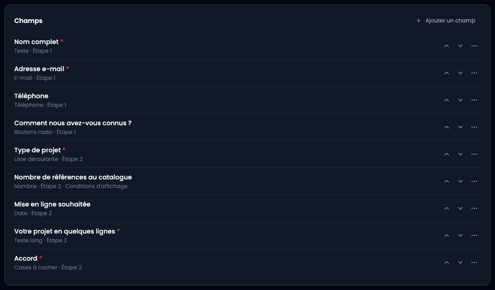
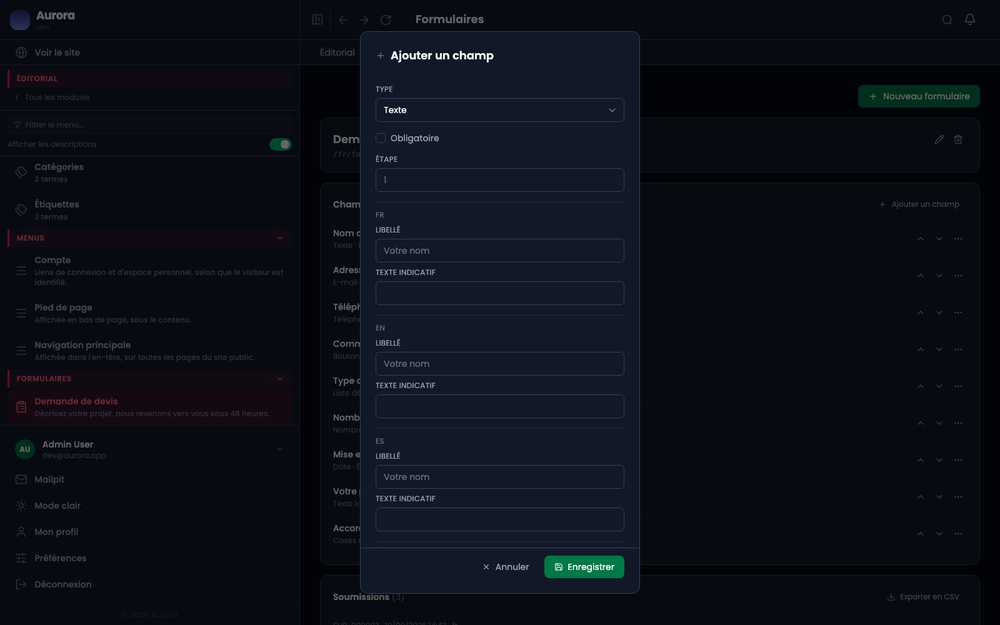
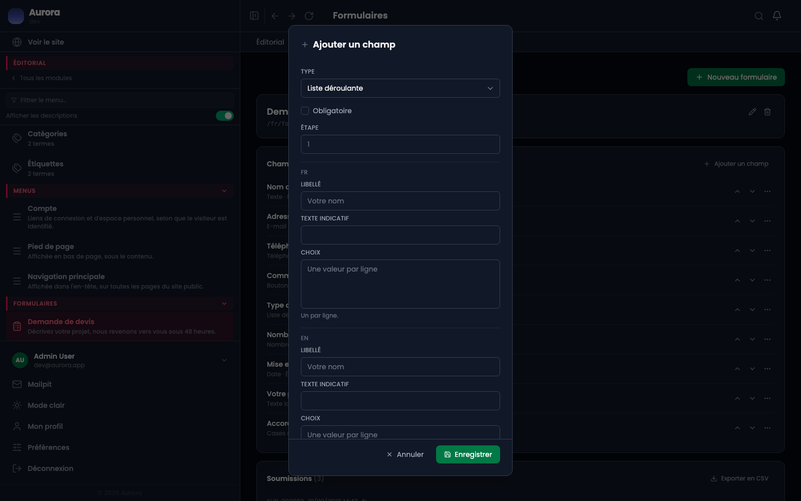
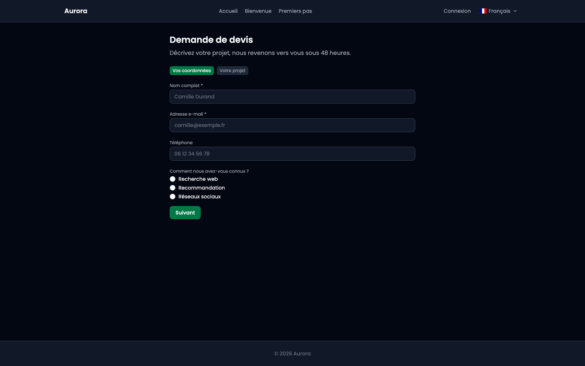
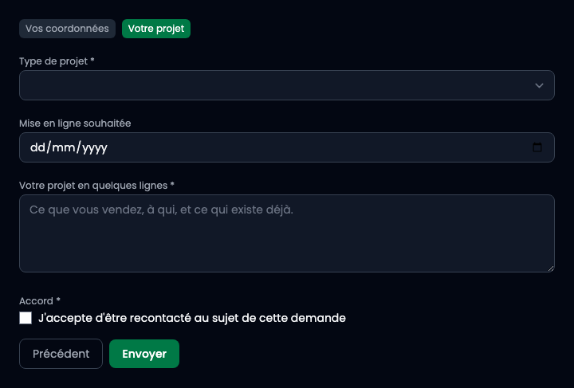

Un champ, c'est une question posée au visiteur. Son **type** décide de la manière dont il y répond : une ligne de texte, une liste, une date, une case à cocher.

## 1. Le type se lit dans la liste

Sous chaque champ, la première mention est son type. C'est la vue d'ensemble : on voit d'un coup ce que le formulaire demande, et sous quelle forme.

- **Texte** et **Texte long** : une ligne, ou un paragraphe.
- **E-mail**, **Téléphone**, **Nombre**, **Date** : du texte, mais vérifié et saisi avec le bon clavier.
- **Liste déroulante**, **Boutons radio**, **Cases à cocher** : un choix parmi des valeurs que vous écrivez.

## 2. La fenêtre d'un champ

**Ajouter un champ** ouvre la même fenêtre que **Modifier**. Le type est en haut parce que c'est lui qui décide du reste : **Obligatoire**, l'**étape**, puis le libellé et le texte indicatif dans chaque langue.

Le **texte indicatif** est le gris qu'on lit dans le champ vide. Il donne un exemple ; il ne remplace pas le libellé, qui reste affiché.

## 3. Un champ à choix réclame ses options

Choisir **Liste déroulante**, **Boutons radio** ou **Cases à cocher** fait apparaître un bloc **Choix**, une valeur par ligne, dans chaque langue.

Les options sont traduites, et la réponse enregistrée est celle de la langue dans laquelle le visiteur a répondu. Un champ à choix sans option ne peut pas être rempli, et l'enregistrement le refuse.

## 4. Ce que le visiteur voit

Sur le site, chaque type prend sa forme habituelle : une ligne pour un texte, des ronds pour des boutons radio, un calendrier pour une date. Le libellé, l'astérisque des champs obligatoires et le texte indicatif viennent de ce que vous avez écrit.

## 5. La suite du formulaire

**Suivant** mène à l'étape d'après. Les réponses déjà données restent en mémoire, et **Précédent** y ramène sans rien perdre : rien n'est envoyé avant le dernier écran.

