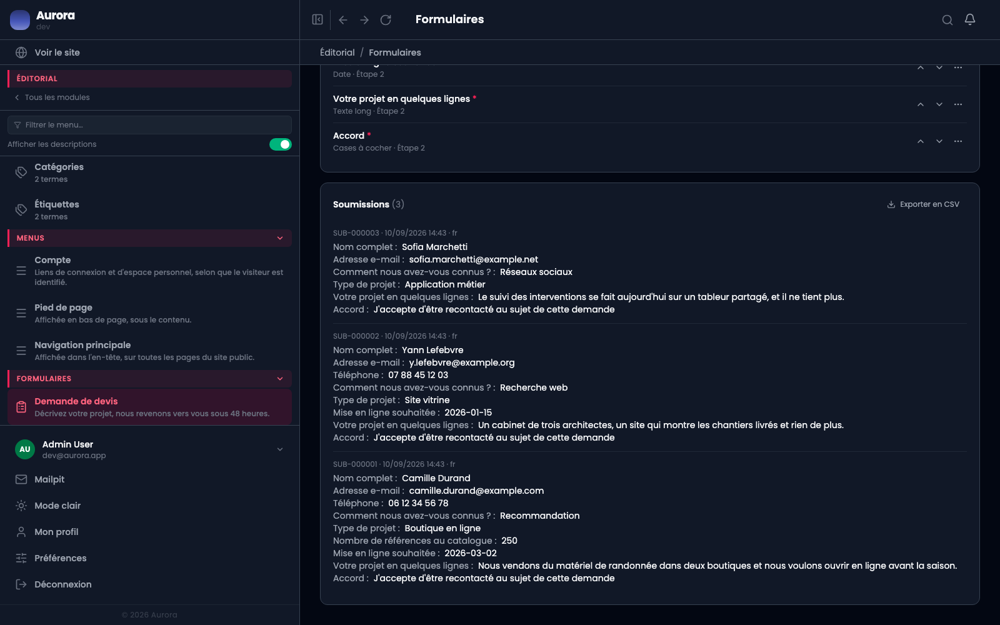
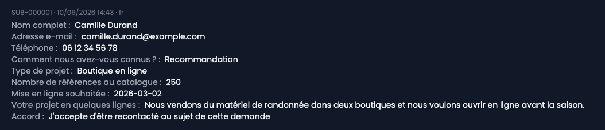
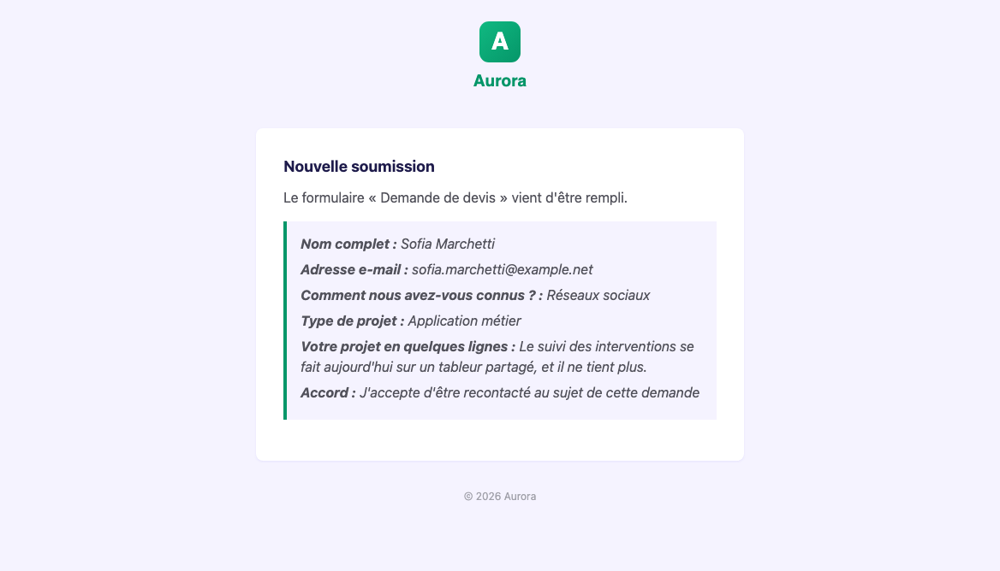
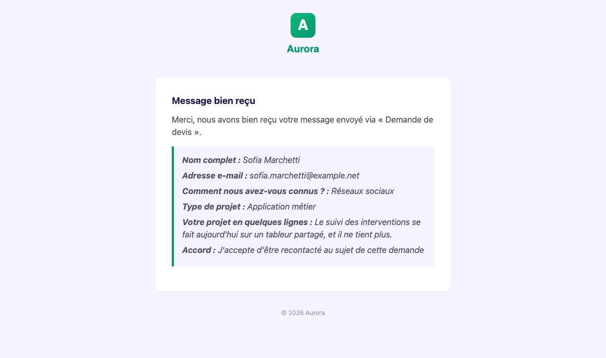

Une demande envoyée par un visiteur est enregistrée, montrée sous le formulaire, et envoyée par e-mail. Rien n'est à rapatrier : les trois arrivent en même temps.

## 1. Les demandes sous le formulaire

Le bloc **Soumissions** ferme l'écran du formulaire, la plus récente en premier. Chaque demande porte sa **référence**, sa date et la langue dans laquelle elle a été remplie.

**Exporter en CSV** reprend le même contenu dans un fichier, une demande par ligne, pour qui veut le trier ailleurs.

## 2. Le détail d'une demande

Chaque réponse est affichée avec le libellé de sa question. Ce libellé est celui d'aujourd'hui : les réponses sont rangées par champ, pas par intitulé, et une question reformulée ne rend pas les anciennes demandes illisibles.

Un champ que le visiteur n'a pas rempli, ou qui ne lui a pas été montré, n'apparaît pas dans sa demande.

## 3. L'e-mail que vous recevez

L'adresse indiquée dans **Prévenir à** reçoit la demande complète, mise en forme, dès qu'elle arrive. C'est la copie qu'on lit sans ouvrir l'administration.

## 4. L'accusé de réception du visiteur

Si le formulaire contient un champ de type **E-mail**, le visiteur reçoit de son côté la confirmation de ce qu'il a envoyé. Elle part dans la langue où il a rempli le formulaire.

Rien à activer : c'est la présence d'un champ e-mail valide qui déclenche l'envoi.

