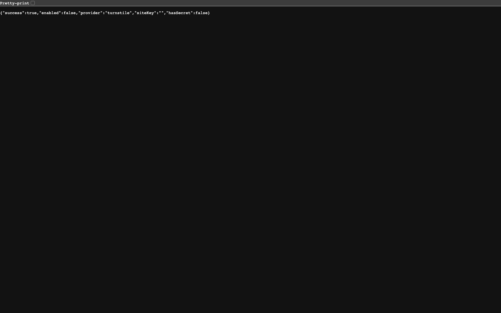

Une vérification anti-robots, désactivée par défaut, qui se branche avec votre propre compte chez le fournisseur.

## Les deux fournisseurs

Turnstile de Cloudflare, ou reCAPTCHA de Google. On en choisit un, on colle ses deux clés, on active.

Les clés sont les vôtres, pas celles d'Aurora : c'est votre compte qui voit le trafic et qui décide de la politique. Aucun service tiers n'est appelé tant que vous n'avez pas activé.

## Sur quoi il s'applique

- Les formulaires du site.
- Les commentaires.

Pas sur la connexion au back-office, qui est protégée autrement, par une limite de cinq tentatives par quart d'heure.

## Si les clés sont fausses

Le formulaire refuse les envois. Vérifiez que la clé publique et la clé secrète ne sont pas inversées : c'est l'erreur la plus fréquente, et le fournisseur ne le dit pas clairement.
