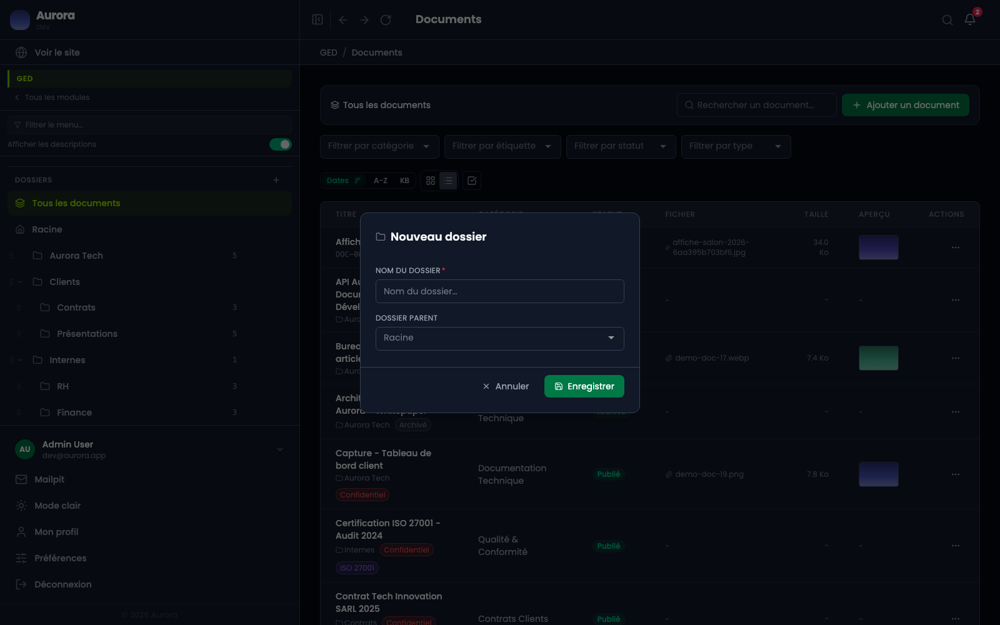
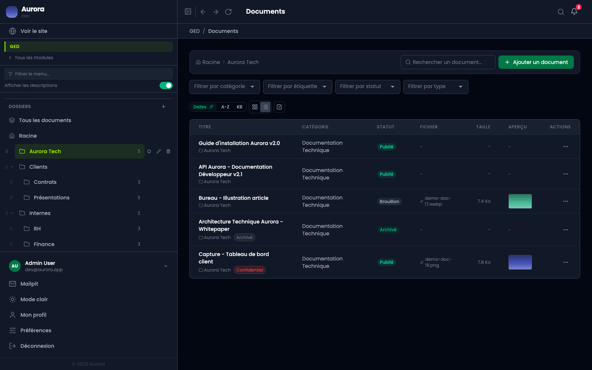

Les dossiers sont le rangement physique de la bibliothèque : un document est dans un dossier, ou à la racine.

## L'arborescence

Elle vit sous la liste des écrans, dans le menu. Chaque dossier affiche le nombre de documents qu'il contient, se replie, et se tire par sa poignée pour changer d'ordre ou de parent.

## Créer un dossier

Le « + » en haut de la liste. Un nom, et le dossier parent : « Racine » pour un dossier de premier niveau, un autre dossier pour l'imbriquer.

## Le filtre

Cliquer un dossier restreint la liste à son contenu. « Tous les documents » revient à la vue complète, « Racine » à ce qui n'est rangé nulle part.

## Ce qu'on peut en faire

- Créer, renommer, imbriquer, mettre en favori.
- Déplacer un document, ou plusieurs d'un coup après les avoir cochés.
- Un dossier supprimé ne détruit pas ses documents : ils remontent.

## Dossier ou catégorie

Le dossier dit où le fichier est rangé, la catégorie dit ce qu'il est. Un document a un seul dossier et une seule catégorie, mais autant d'étiquettes qu'on veut. Les trois se cumulent sans se remplacer.
