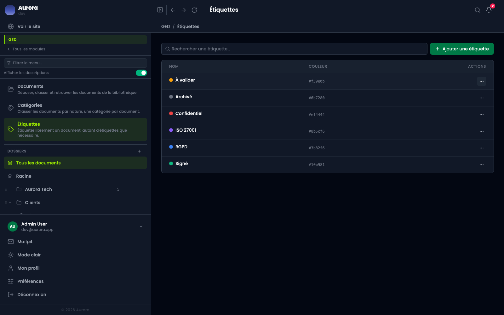
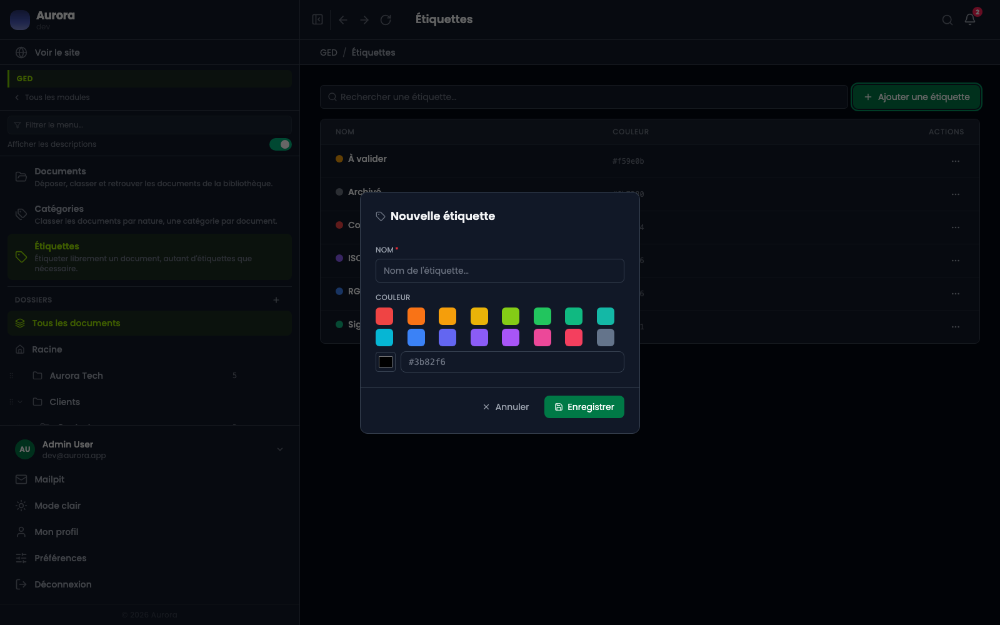
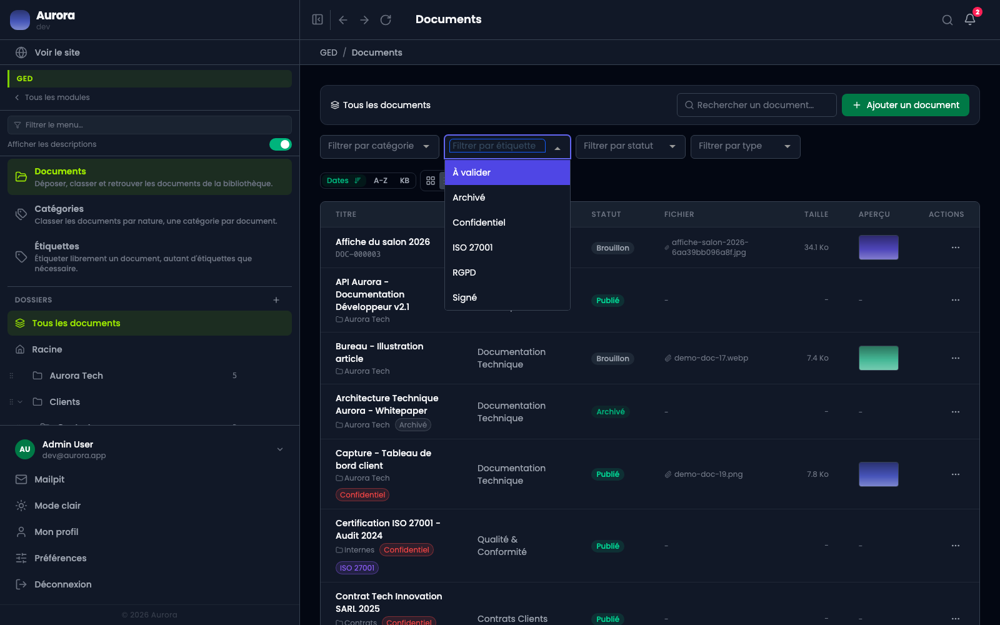

L'étiquette ne range pas, elle retrouve. Là où la catégorie tranche, l'étiquette s'accumule.

## La liste

Un nom et une couleur, celle de la pastille qui suivra l'étiquette partout où elle s'affiche.

## En créer une

Un nom, et une couleur choisie dans la palette ou écrite en hexadécimal.

## S'en servir pour filtrer

La bibliothèque filtre par étiquette comme elle filtre par catégorie, et les deux se combinent.

## Le conseil

Une étiquette utile est une étiquette qu'on réutilise. Une étiquette posée une seule fois sur un seul document ne sert à rien qu'une recherche par titre ne ferait déjà.
