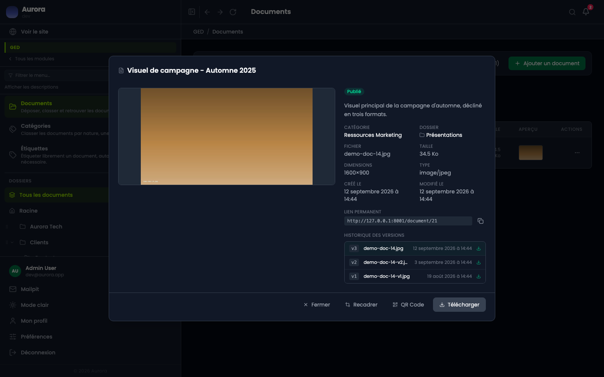
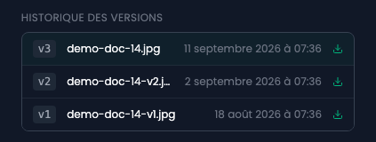

Remplacer une image partout où elle est utilisée revient à remplacer son fichier, pas à en déposer un nouveau.

## Le panneau de détail

L'aperçu d'une ligne ouvre la fiche : la vignette, les informations, le lien permanent, et l'historique s'il y en a un.

## L'historique

Une ligne par version, la plus récente en tête et mise en avant : son numéro, le nom du fichier, la date de l'enregistrement, et de quoi le télécharger. Le bloc n'apparaît qu'à partir de deux versions, puisqu'avant il n'y a pas d'histoire à raconter.

## Comment ça marche

- Le document garde son identité, ses étiquettes et son adresse ; seul le fichier change.
- L'historique conserve les versions précédentes, trois par défaut. Le nombre se règle, dans un onglet réservé au développeur du site.
- Les tailles servies sont régénérées à chaque remplacement.

## Quand ne pas s'en servir

Si la nouvelle image n'est pas la même image, déposer un nouveau document. Une version est censée être le même contenu, corrigé.
