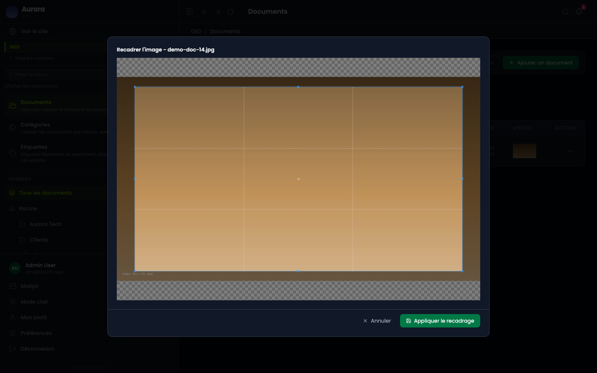
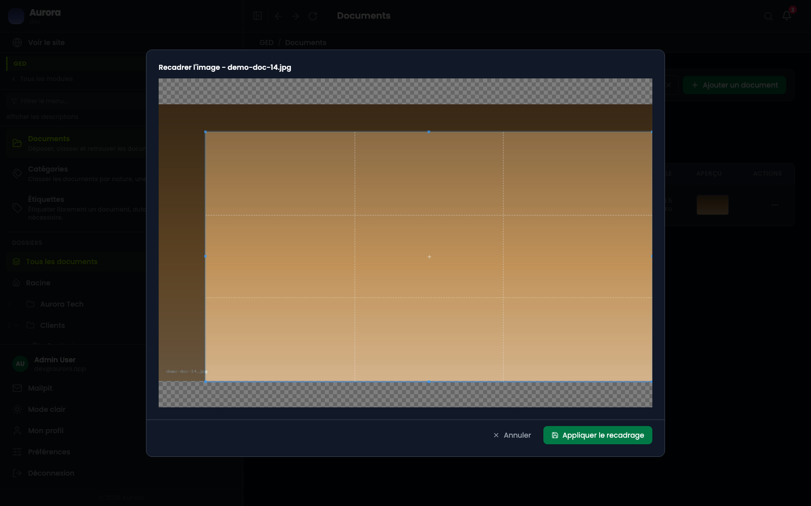

Le recadrage coupe l'image. C'est un geste définitif, à distinguer du point d'intérêt, qui se règle sur la publication et ne touche à aucun fichier.

## L'outil

Il s'ouvre depuis le panneau de détail d'une image, par « Recadrer ».

## Choisir la zone

Le cadre se tire à la souris, ses poignées l'ajustent, et la grille aide à placer le sujet. Ce qui reste en dehors sera perdu.

## Ce que ça change

Le fichier est remplacé, les tailles servies sont régénérées, et une version s'ajoute à l'historique. L'image d'avant reste téléchargeable depuis cet historique, tant qu'elle n'est pas sortie de la fenêtre des trois versions conservées.

## Quand ne pas recadrer

Si le but est seulement de bien cadrer une vignette, le **point d'intérêt** de la publication fait le travail sans rien détruire : il dit quelle partie de l'image doit rester visible quand le gabarit coupe. Le recadrage se réserve aux images qui contiennent quelque chose qui ne doit jamais s'afficher.
