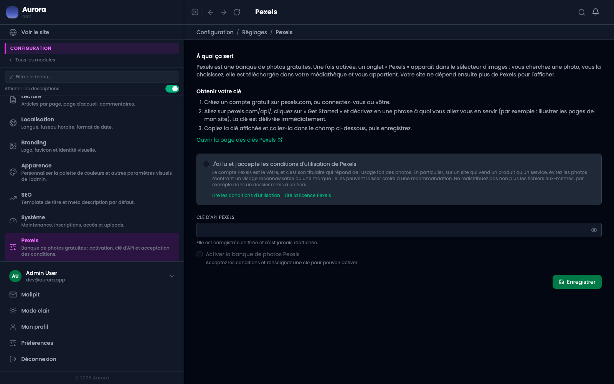

Chercher une photo sans quitter l'écran, la déposer dans la bibliothèque, et que le crédit suive.

## Le brancher

- Une clé d'API obtenue chez Pexels, collée dans les réglages.
- Les conditions d'utilisation acceptées explicitement : la date et le compte qui a accepté sont enregistrés.
- Éteint par défaut, et branché avec le compte du client, pas le mien.

## S'en servir

La recherche se fait depuis le sélecteur d'images, celui qui s'ouvre pour choisir une vignette ou remplir une zone média : un onglet « Pexels » s'y ajoute une fois la banque activée. La photo choisie est téléchargée, rangée, et le nom de son auteur ainsi que le lien vers sa page sont enregistrés avec elle. L'affichage du crédit sous l'image est un réglage.
