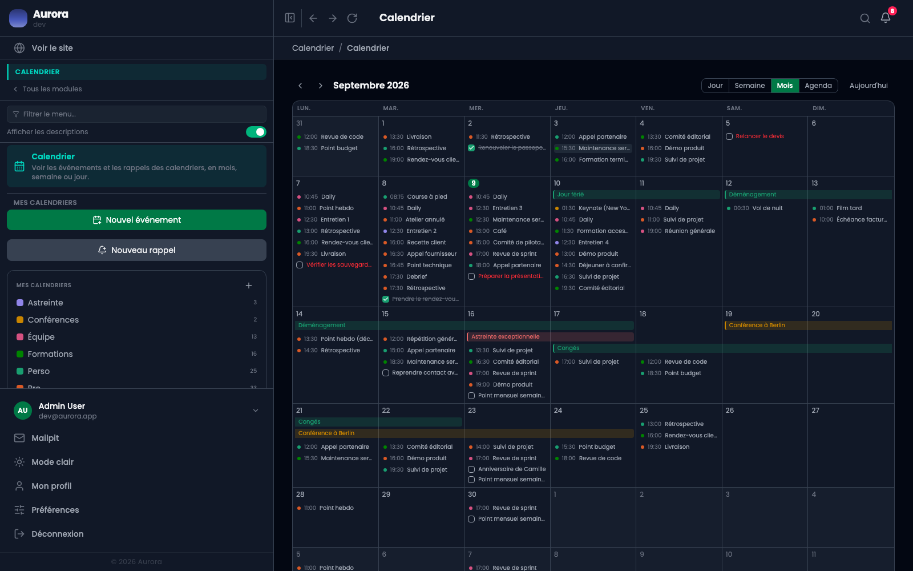

Le même contenu, quatre façons de le regarder. Le choix se fait sur ce qu'on cherche, pas sur une préférence.

## Les quatre

- Jour : les heures d'une journée, pour préparer un rendez-vous.
- Semaine : les événements posés à leur heure sur sept colonnes. Ceux qui se chevauchent se dessinent côte à côte, les journées entières restent en haut.
- Mois : une vue d'ensemble, où un événement long se dessine en une barre traversant les cases.
- Agenda : la liste de ce qui vient, sans grille.

## Se déplacer

Les flèches avancent d'une période, « aujourd'hui » ramène au présent. Les vues à l'heure s'ouvrent sur l'heure courante, ce qui met parfois la matinée hors champ : il faut remonter.
