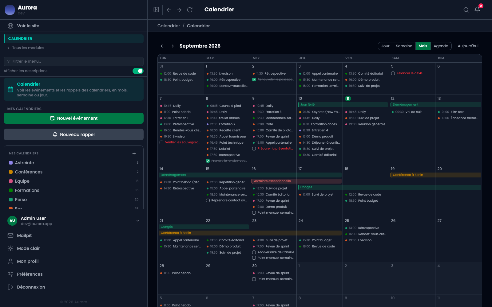
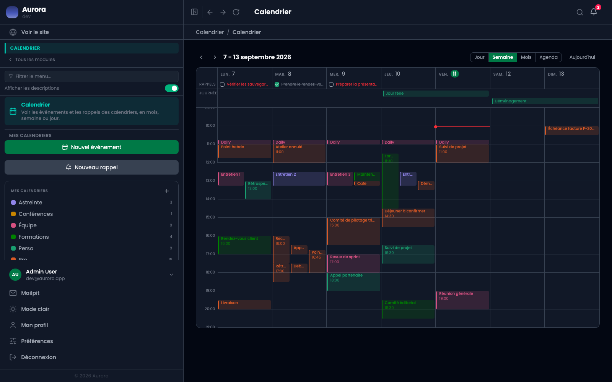
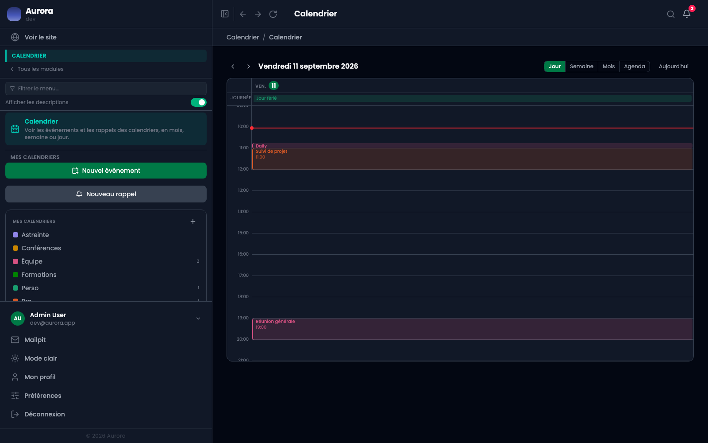
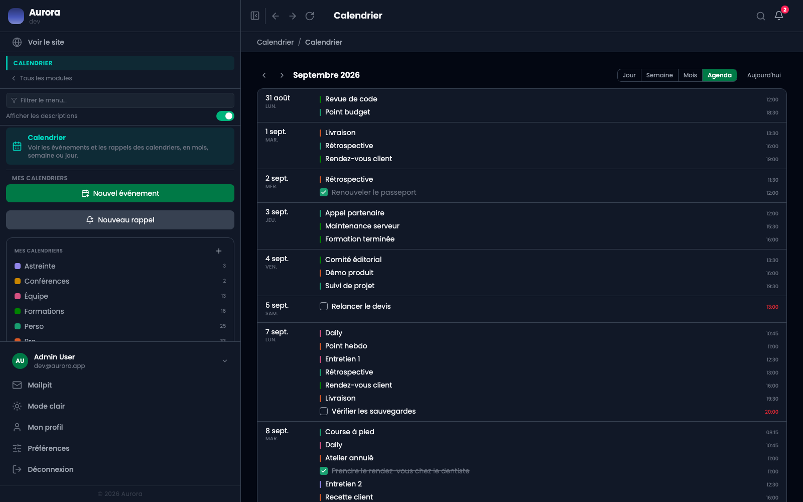

Le même contenu, quatre façons de le regarder. Le choix se fait sur ce qu'on cherche, pas sur une préférence.

## Le mois

Une vue d'ensemble. Un événement long se dessine en une barre qui traverse les cases, et les journées entières se posent en haut de chaque jour.

## La semaine

Les événements à leur heure sur sept colonnes. Ceux qui se chevauchent se dessinent côte à côte, la ligne rouge marque l'heure courante, et les rappels du jour occupent une bande à part au-dessus de la grille.

## Le jour

Les heures d'une seule journée, pour préparer un rendez-vous.

## L'agenda

La liste de ce qui vient, sans grille. C'est la vue qui se lit le plus vite quand on cherche « et après ? ».

## Se déplacer

Les flèches avancent d'une période, « Aujourd'hui » ramène au présent. Les vues à l'heure s'ouvrent sur l'heure courante, ce qui met parfois la matinée hors champ : il faut remonter.
