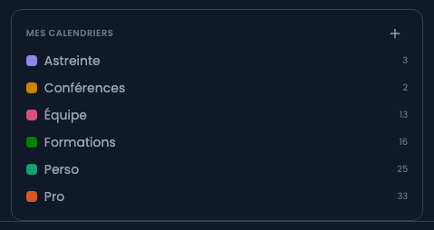
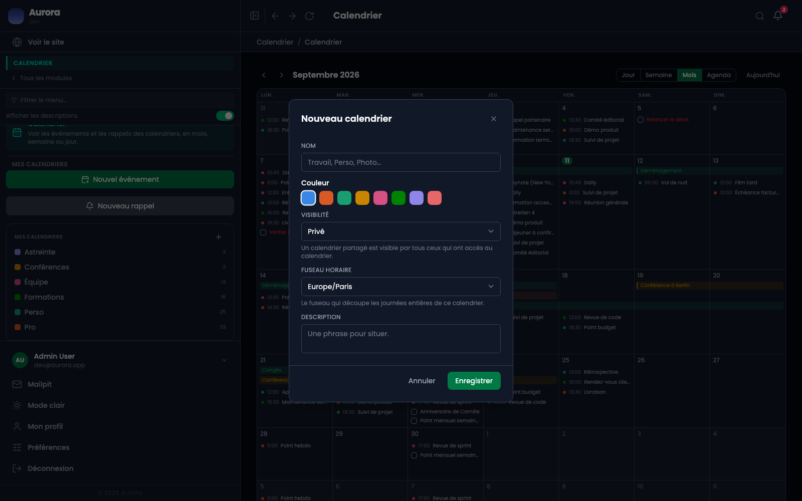

Plusieurs agendas plutôt qu'un seul : c'est ce qui permet de montrer les rendez-vous sans montrer les échéances, ou l'inverse.

## La liste

Chaque agenda porte sa couleur et le nombre d'événements de la période affichée. Le clic l'affiche ou le masque, sans rien supprimer : c'est un filtre d'affichage, pas un réglage de l'agenda.

## En créer un

Le « + » en haut de la liste.

## Ce que porte un agenda

- Un nom et une description.
- Une couleur, qui teinte tous ses événements.
- Un fuseau horaire, utile quand une conférence se tient ailleurs.
- Une visibilité : privé, ou partagé avec les comptes du site.
