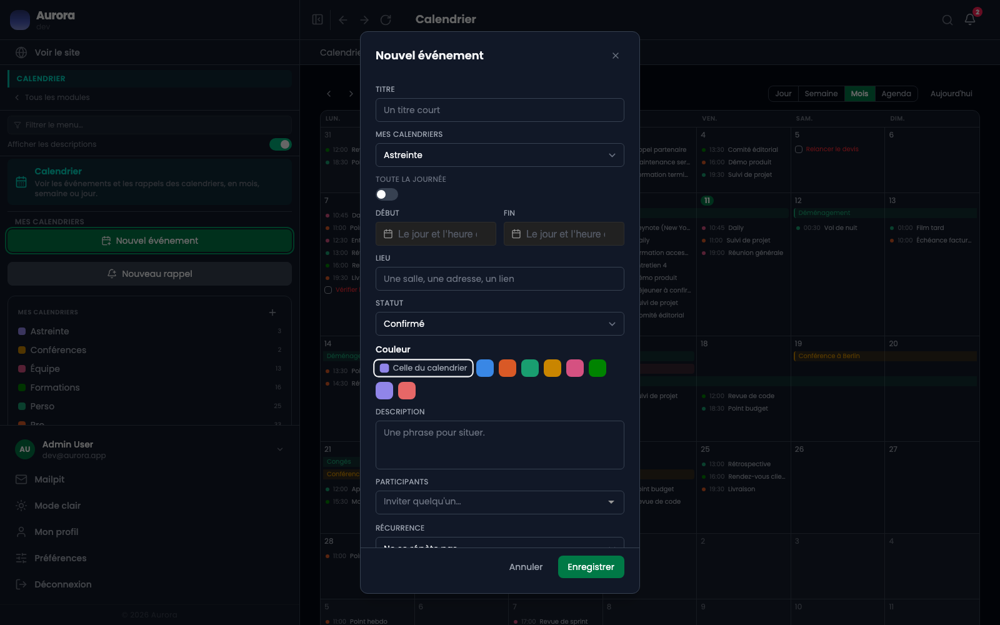
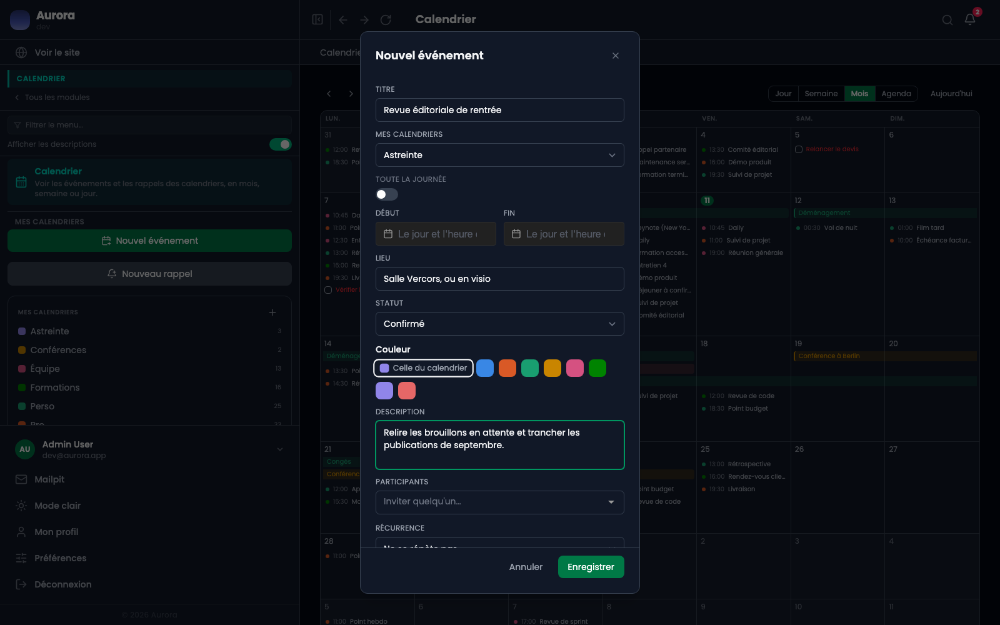

Un événement occupe une plage horaire, ou une journée entière. Le reste est du détail utile.

## Le panneau

Il s'ouvre par « Nouvel événement », ou en cliquant une case du calendrier.

## Ce qu'il porte

- Un titre, une description, un lieu.
- Un début et une fin. Une fin placée avant le début est refusée : l'erreur ne s'enregistre pas.
- « Toute la journée », qui le sort de la grille horaire et le pose dans la bande du haut.
- Une couleur propre, qui prend le pas sur celle de l'agenda.

## Les trois états

- À confirmer : le rendez-vous est pris mais pas sûr.
- Confirmé.
- Annulé : l'événement reste visible, barré, plutôt que de disparaître. Une annulation qu'on ne voit plus est une annulation que l'on oublie d'avoir eue.
