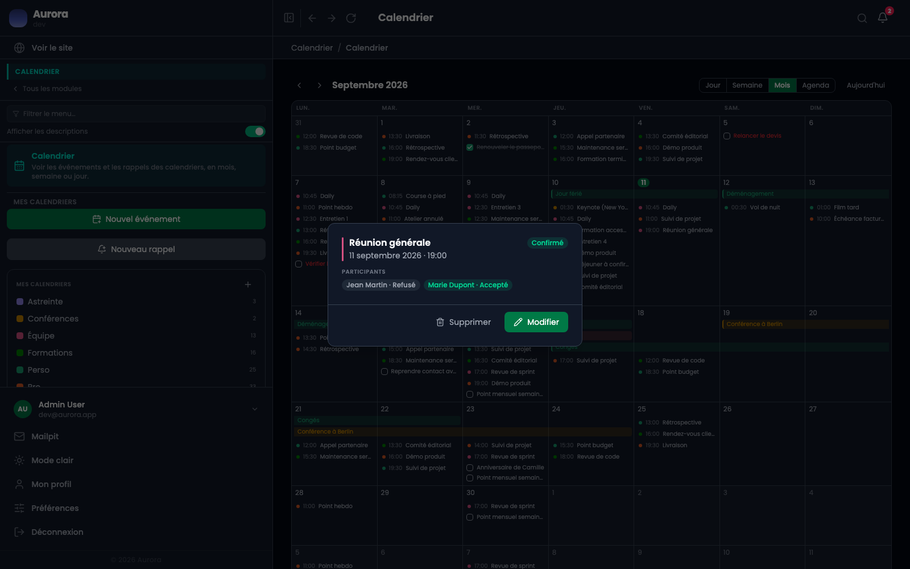

Un événement peut porter des invités, et chacun a un état de réponse que l'on lit sur l'événement.

## Les réponses, sur l'événement

Un clic sur l'événement ouvre sa bulle : chaque invité y est suivi de sa réponse.

## Les quatre réponses

- Sans réponse : invité, n'a rien dit.
- Accepté.
- Refusé.
- Peut-être.

## Inviter

Le champ est dans la fenêtre de modification de l'événement. Il propose les comptes du site, et rien d'autre : **ce n'est pas un envoi d'invitation par e-mail à une adresse extérieure**. L'invitation déclenche une notification pour le compte invité.

