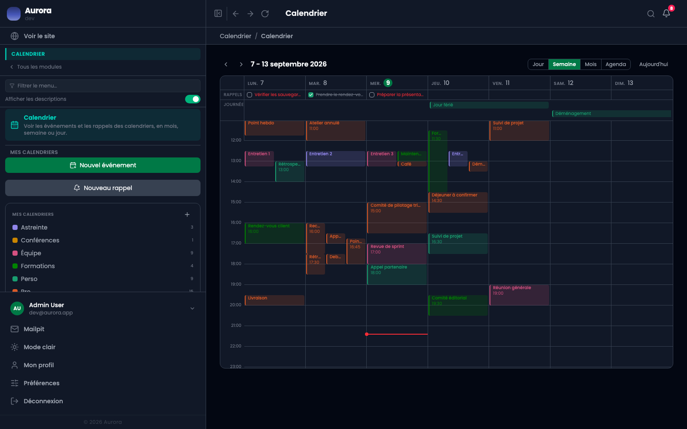

Une alerte prévient avant l'événement. Elle se pose sur l'événement, pas sur l'agenda.

## Les régler

- Un délai en minutes avant le début.
- Un canal : notification dans l'administration, ou e-mail.
- Plusieurs alertes sur un même événement, ce qui permet un rappel la veille et un autre dix minutes avant.

## Qui les envoie

Les alertes partent toutes seules, en tâche de fond. Une alerte manquée ne se rattrape pas : elle est passée, et l'événement reste. Si plus aucune alerte n'arrive, ce n'est pas un réglage de l'événement, c'est le côté technique du site qui est en cause.
