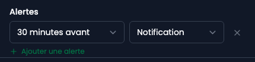

Une alerte prévient avant l'événement. Elle se pose sur l'événement, pas sur l'agenda.

## Où elles vivent

Dans la fenêtre de modification de l'événement, sous les participants.

## Les régler

Chaque ligne est un délai et un canal. Les délais courants sont proposés, « Personnalisé… » permet un autre moment. Le canal est une notification dans l'administration, ou un e-mail.

**Plusieurs alertes sur un même événement**, ce qui permet un rappel la veille et un autre dix minutes avant.

## Une remarque sur le canal

Une alerte qui n'arrive que dans l'application ne se voit qu'en y étant déjà. Pour ce qui ne doit pas être manqué, l'e-mail est le bon canal.

## Qui les envoie

Les alertes partent toutes seules, en tâche de fond. Une alerte manquée ne se rattrape pas : elle est passée, et l'événement reste. Si plus aucune alerte n'arrive, ce n'est pas un réglage de l'événement.
