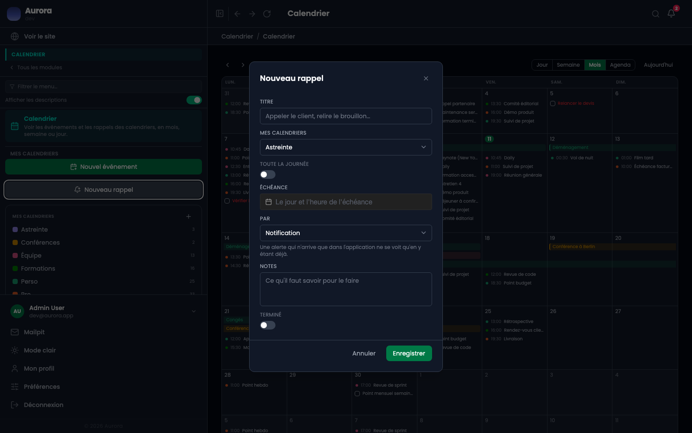
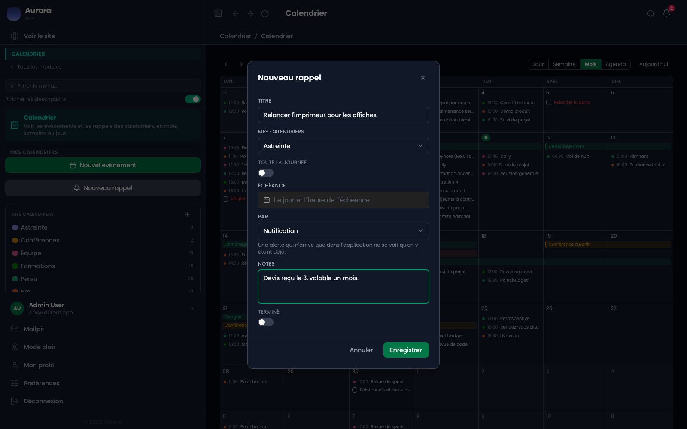

Un rappel n'occupe pas de plage horaire : il a une échéance, et il se coche.

## Le panneau

« Nouveau rappel ». Un titre, un agenda, une échéance qui peut être une journée entière, un canal comme pour une alerte, des notes, et l'état fait ou pas fait.

## Où ils s'affichent

Dans une bande à part, au-dessus de la grille des heures. Un rappel fait est barré et coché, un rappel dont l'échéance est passée s'écrit en rouge, et il reste visible tant qu'il n'est pas coché.

## Ce qui le distingue d'un événement

- Une seule date, pas un début et une fin.
- Un état fait ou pas fait, alors qu'un événement a lieu ou n'a pas lieu.
