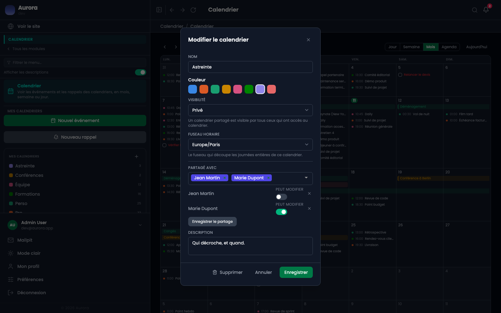
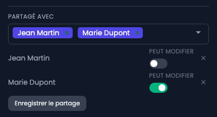

Le partage à un compte est le partage interne : la personne voit l'agenda dans sa propre liste.

## Où ça se règle

Dans la fenêtre du calendrier, celle qui sert aussi à le renommer.

## Les deux niveaux

Chaque personne ajoutée porte un interrupteur « peut modifier » :

- Éteint, c'est la lecture : la personne voit les événements et ne peut rien changer.
- Allumé, c'est l'écriture : elle peut ajouter et modifier.

## Ce que ça ne fait pas

Partager un agenda ne partage pas les autres. Et un agenda privé non partagé n'est visible de personne d'autre, y compris d'un administrateur : la recherche globale elle-même le respecte.
