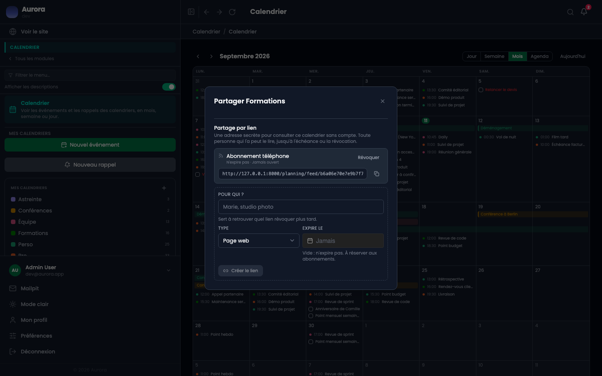
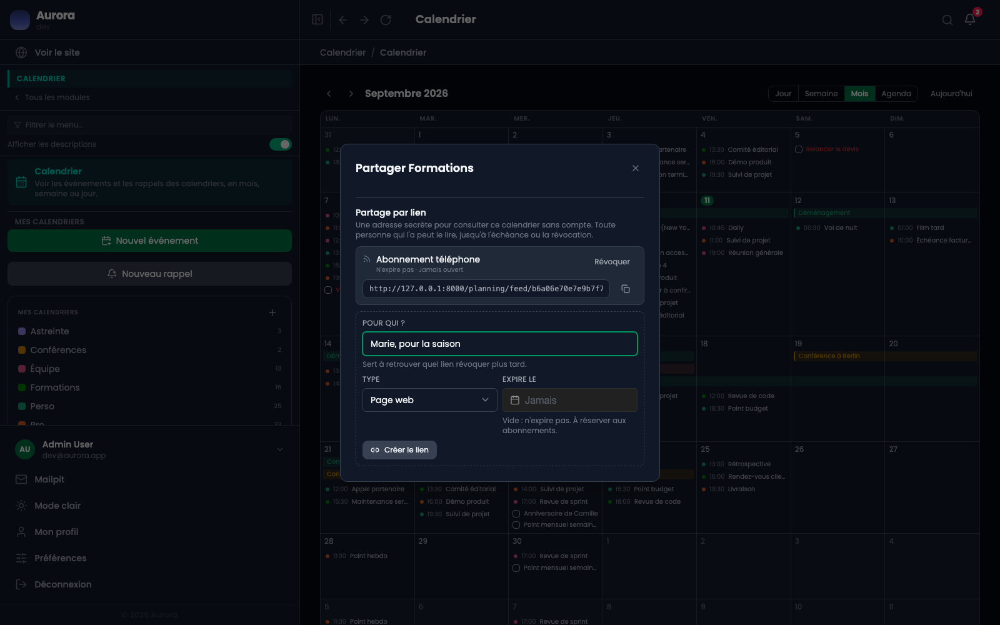
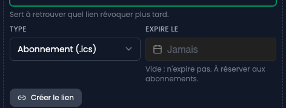

Le lien de partage est le partage externe : il s'envoie à qui n'a pas de compte sur le site. Toute personne qui l'a peut lire l'agenda, jusqu'à l'échéance ou la révocation.

## Les liens d'un agenda

La fenêtre liste ce qui existe déjà : le libellé, l'échéance, la dernière ouverture, l'adresse et de quoi la copier.

## En créer un

Un libellé, qui sert à se souvenir à qui on l'a donné et donc lequel révoquer plus tard. Une échéance facultative : vide, le lien n'expire pas.

## Les deux types

- Page web : une page en lecture seule, à ouvrir dans un navigateur.
- Abonnement (.ics) : une adresse à coller dans une autre application d'agenda.

## Le révoquer

Un lien se révoque à tout moment, et cesse aussitôt de répondre. La date de dernière utilisation est enregistrée, ce qui permet de voir lesquels servent encore.
