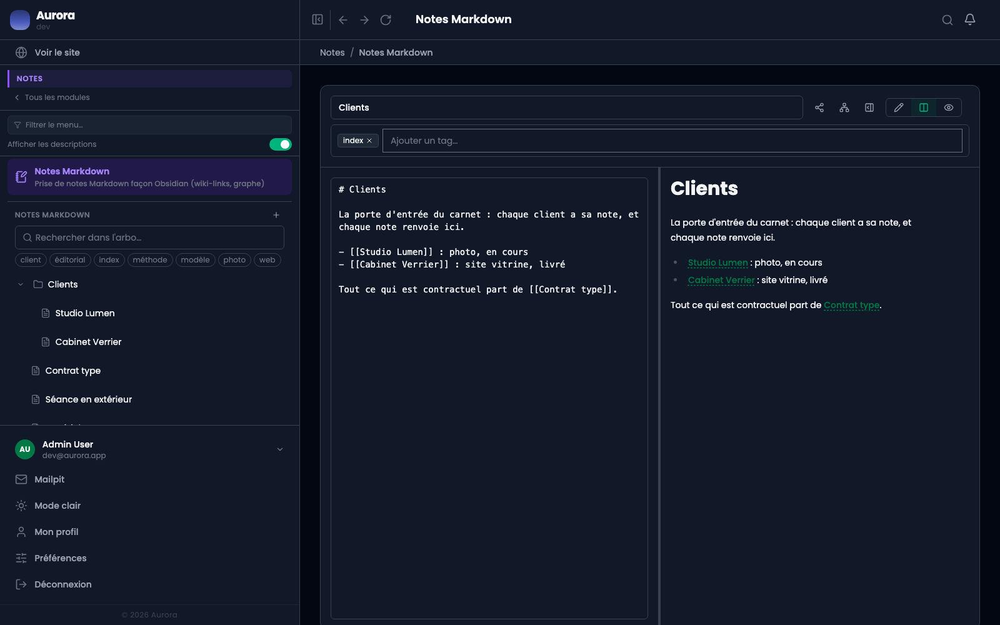

Un module de prise de notes en Markdown, avec le rendu à côté de la source. Les notes sont personnelles : chacun ne voit que les siennes.

## 1. La source et le rendu

À gauche ce qu'on écrit, à droite ce que ça donne, mis à jour en tapant. Le Markdown habituel : titres, listes, tableaux, code, citations.

Le titre est en haut, dans son propre champ. C'est lui qui sert d'adresse aux liens entre notes, alors autant qu'il soit court et stable.

## 2. L'arborescence

Les notes vivent dans le menu latéral. Une note se range **sous** une autre : l'arborescence est une note dans une note, pas un dossier à part, et une note parente reste une note qu'on peut écrire.

L'ordre entre notes voisines se règle en les déplaçant. Le filtre par étiquette, au-dessus, réduit l'arbre à ce qui porte l'étiquette choisie.

## 3. Trois façons de regarder

Les trois boutons en haut à droite basculent entre **édition seule**, **édition et aperçu**, et **aperçu seul**. Le dernier sert à relire : la note occupe toute la largeur, sans le Markdown à côté.

## Ce qui n'est pas là

Pas de partage d'écriture à plusieurs, pas d'historique de versions. Une note est un carnet, pas un document collaboratif.
