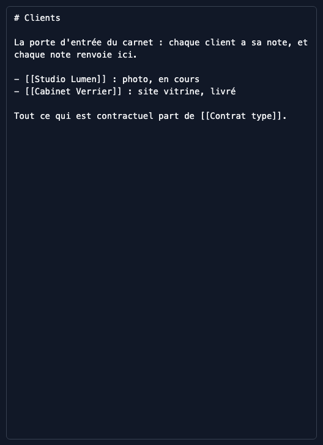
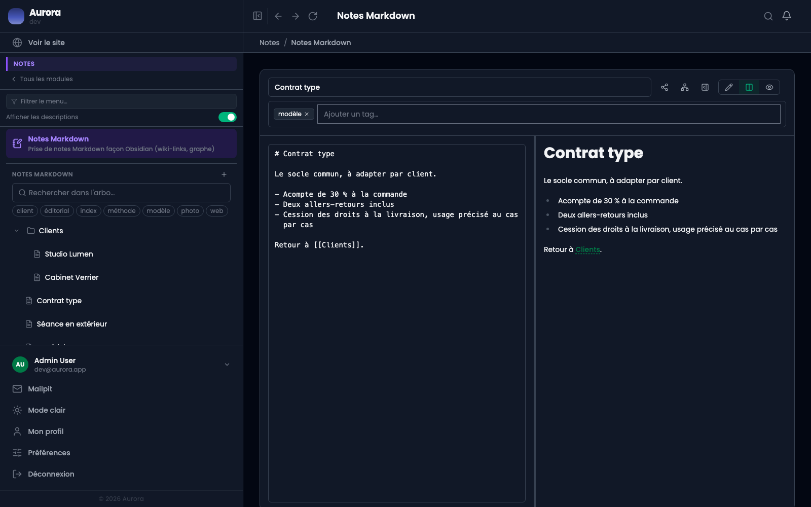

Écrire le nom d'une autre note entre doubles crochets crée un lien. C'est tout le mécanisme.

## 1. Écrire un lien

`[[Contrat type]]` dans la source devient un lien dans le rendu, cliquable, qui ouvre la note visée. Ouvrir un double crochet propose les notes existantes.

Un lien vers une note qui n'existe pas encore est permis : il marque une intention, et se résout le jour où la note est créée sous ce titre.

## 2. La note visée

Elle n'a rien de particulier : c'est une note comme les autres, qui se trouve être citée. Ce sont les notes qui pointent vers elle qui font le réseau, pas elle.

Le lien pointe sur le **titre**. Renommer une note réécrit les liens qui la visaient, mais un titre changé à la main dans une autre note, lui, ne suit pas : c'est là que le panneau des mentions non liées sert.

