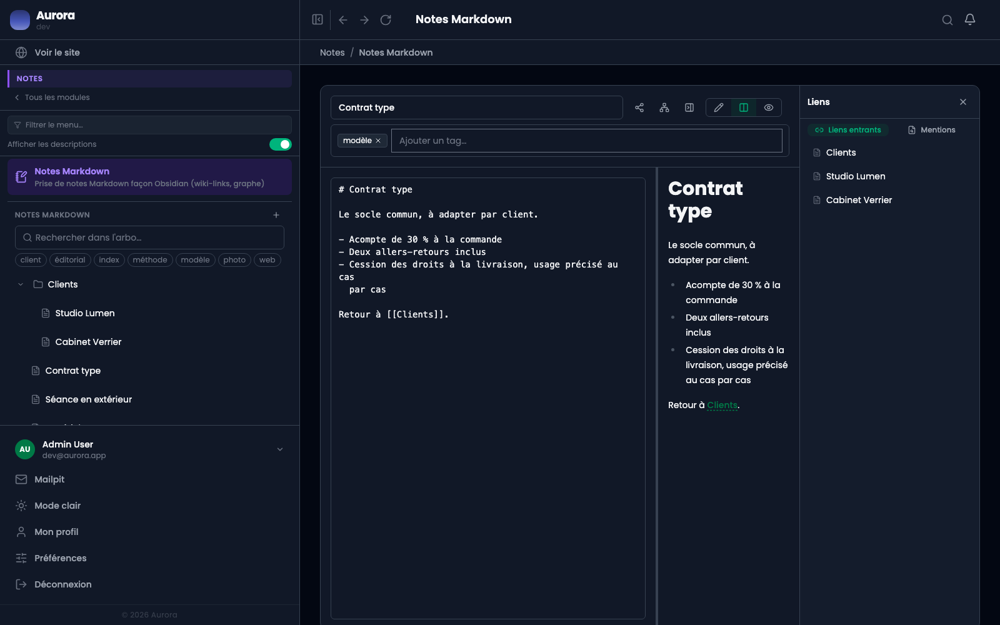

Sous une note, la liste de celles qui la citent. C'est ce qui transforme un tas de notes en réseau.

## 1. Ouvrir le panneau

Le bouton en haut à droite ouvre un panneau à deux onglets : **Liens entrants** et **Mentions**. Le premier liste les notes qui citent celle-ci entre doubles crochets.

## 2. Qui cite cette note

Chaque entrée nomme la note d'où part le lien. On voit donc d'un coup ce qui dépend de cette note : utile avant de la réécrire, et utile pour retrouver une note qu'on ne sait plus nommer en partant d'une qu'on connaît.

