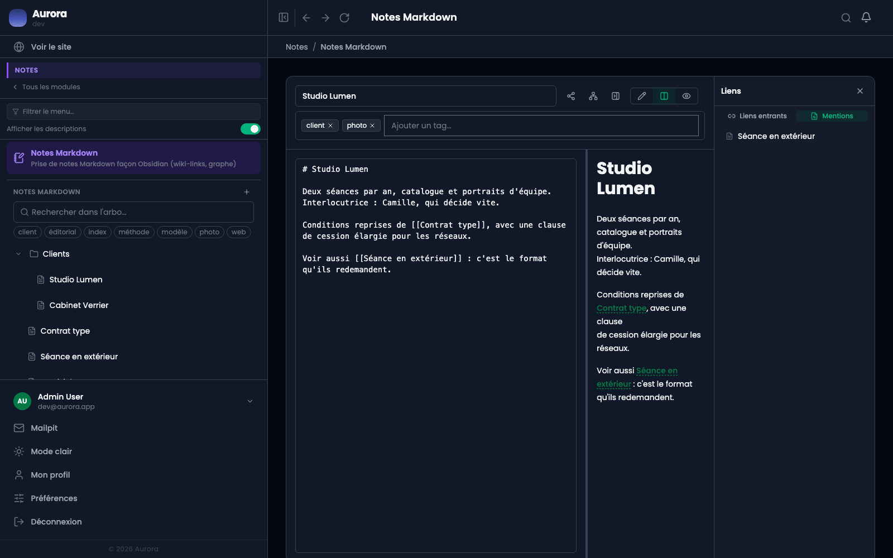

Une note peut être citée sans être liée : son titre apparaît en clair dans une autre, sans crochets.

## Ce que le panneau montre

L'onglet **Mentions** liste les notes dont le texte contient le titre de celle-ci, sans lien. Chacune se relie d'un geste, ou se laisse telle quelle.

Quand les relier ? Quand le lien serait utile à la lecture, pas par principe. Une note où le titre apparaît dans une phrase de passage n'a rien à gagner à devenir un lien.

