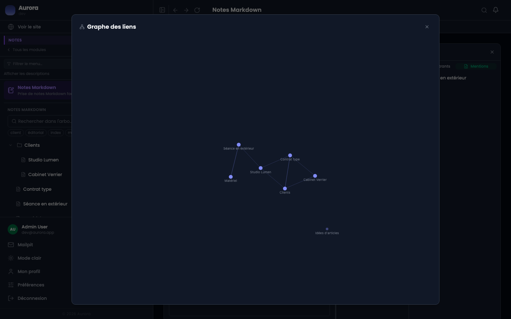

Le graphe montre les notes et leurs liens. Il se lit vite et se navigue au clic : un nœud ouvre sa note.

## Ce qu'on y voit

- Les notes très citées, qui font office de points d'entrée.
- Les **îlots** : une note ou un petit groupe sans lien vers le reste.
- Les grappes, qui trahissent un sujet devenu assez gros pour mériter sa note d'index.

Un îlot n'est pas un défaut. Une note isolée peut être parfaitement à sa place : le graphe montre la forme du carnet, il ne la juge pas.

