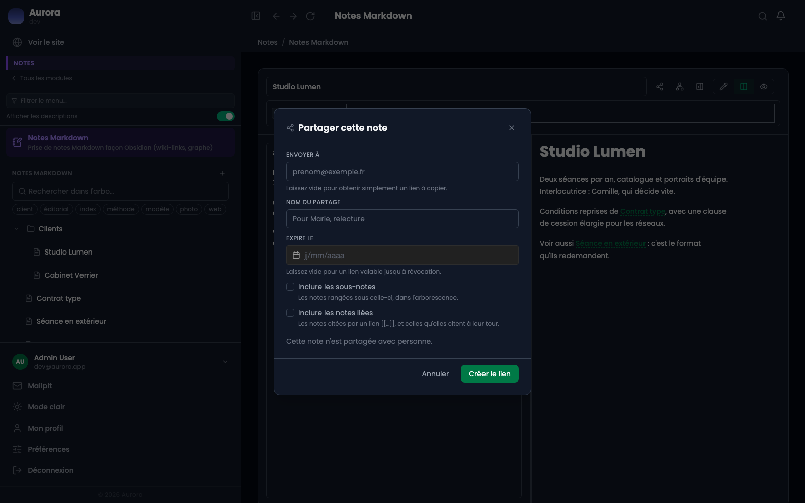

Une note se montre à l'extérieur par un lien, sans donner de compte à personne.

## La fenêtre de partage

Elle demande à qui, sous quel nom, et jusqu'à quand : les trois choses dont on a besoin six mois plus tard pour savoir ce qu'on a donné et à qui.

- **Envoyer à** : laissé vide, on obtient simplement un lien à copier.
- **Nom du partage** : pour se souvenir à qui il a été donné.
- **Expire le** : facultatif ; sans date, le lien vaut jusqu'à révocation.
- **Inclure les sous-notes** : la branche entière plutôt que la note seule.
- **Inclure les notes liées** : pour que les renvois mènent quelque part.

Ce que voit le lecteur : la note rendue, en lecture seule, sans l'administration autour. Les images de la note sont servies par le même lien ; rien d'autre du carnet n'est atteignable. La révocation prend effet aussitôt.

