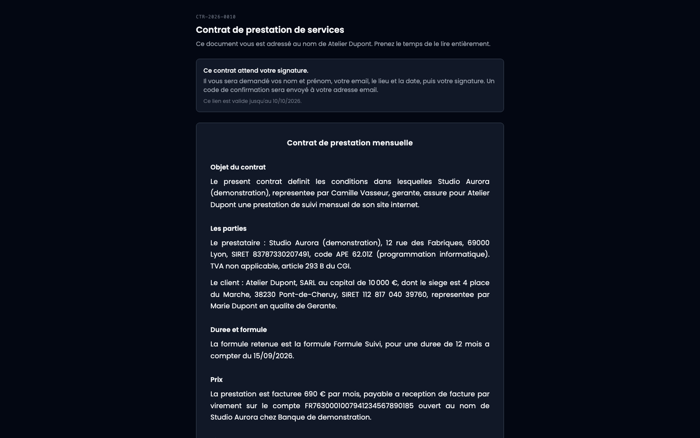
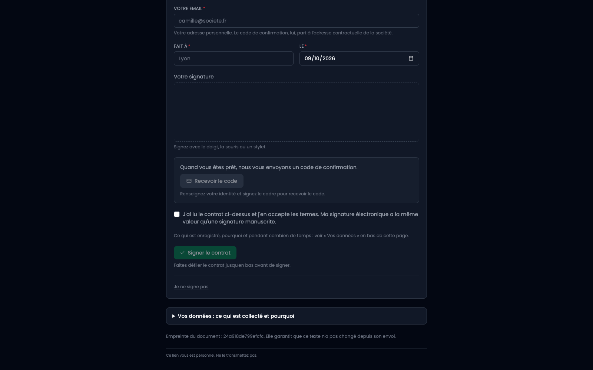
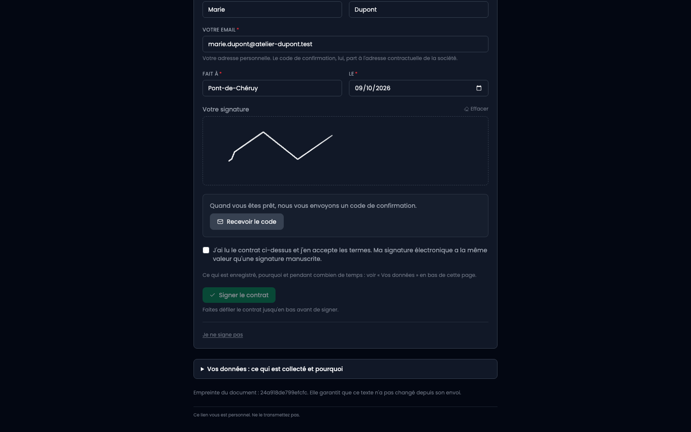
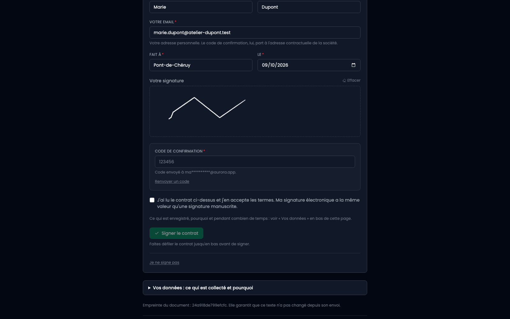
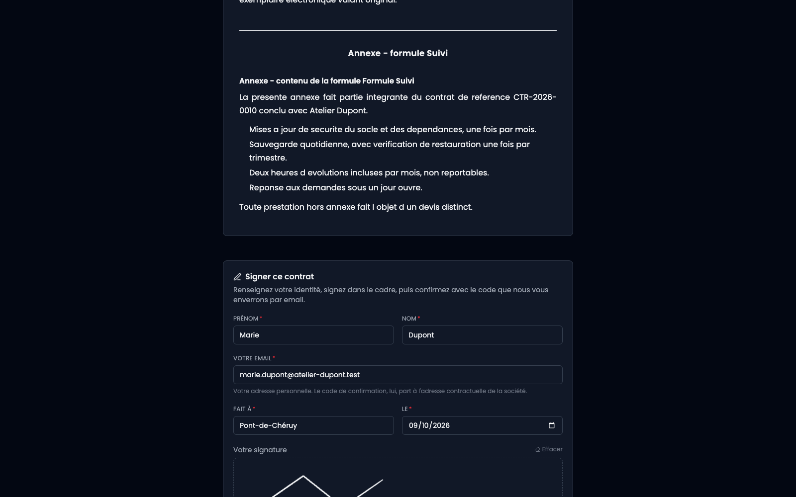
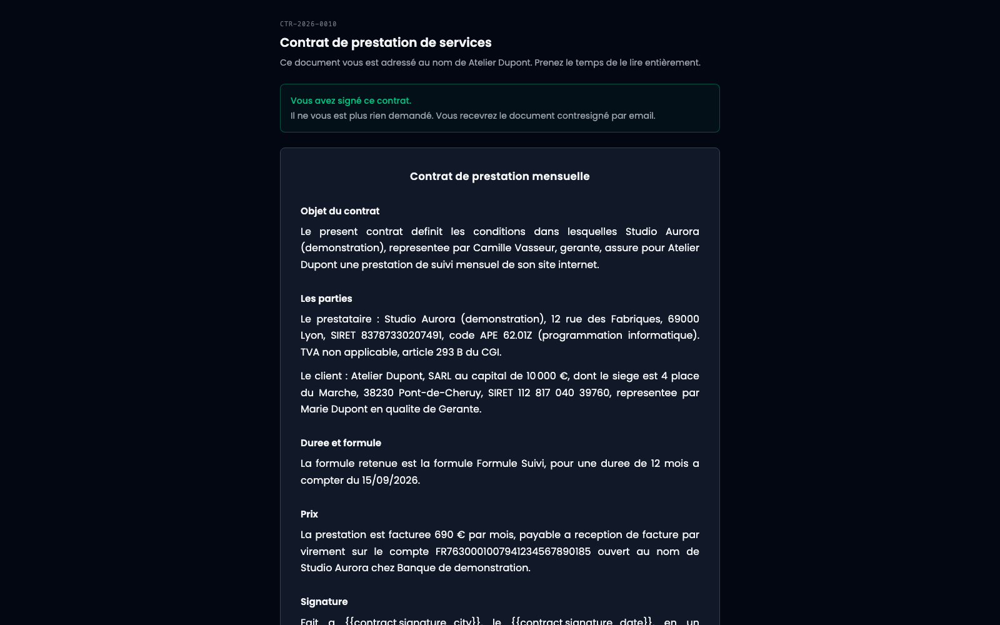

C'est la seule page du produit qu'un client voit. Pas de compte, pas de mot de passe : l'adresse reçue par e-mail est la clé.

## 1. Ce qu'il découvre en arrivant

Le contrat, en entier, tel qu'il a été scellé. Le document affiché est le HTML stocké, jamais régénéré : ce que le client lit est exactement ce que l'empreinte couvre.

## 2. Le document et la mention d'information

Sous le contrat, un dépliant « Vos données : ce qui est collecté et pourquoi » dit ce qui sera enregistré à la signature, et pour combien de temps. Il est affiché au moment où les données sont demandées, pas ailleurs.

En bas de page, l'empreinte du document est rappelée au client : elle garantit que le texte n'a pas changé depuis l'envoi.

## 3. Le formulaire de signature

Prénom, nom, e-mail personnel, lieu, date, puis un cadre où signer au doigt, à la souris ou au stylet.

Une phrase mérite d'être lue : l'e-mail demandé ici est l'adresse **personnelle** du signataire, alors que le code de confirmation, lui, part à l'adresse contractuelle de la société. Les deux ne se confondent pas, et c'est délibéré.

## 4. L'identité et le trait

Le bouton qui demande le code reste éteint tant que l'identité n'est pas complète et que le cadre n'est pas signé. Ce n'est pas un caprice : le code ne se demande qu'une fois qu'il y a quelque chose à confirmer.

## 5. Le code de confirmation

Il part à l'adresse contractuelle de la société, affichée masquée sous le champ. Le client le recopie. Un lien « Renvoyer un code » est là si le premier se perd.

Si l'envoi échoue, l'écran le dit et propose de réessayer, au lieu d'annoncer un envoi qui n'a pas eu lieu.

## 6. Accepter et signer

La case d'acceptation dit que la signature électronique a la même valeur qu'une signature manuscrite. Le bouton reste éteint tant que le contrat n'a pas été déroulé jusqu'en bas : la page veut qu'on l'ait vu passer.

## 7. C'est signé

La signature est enregistrée avec sa date, l'adresse IP et le navigateur. Le même lien, rouvert plus tard, affichera le contrat signé : c'est ce qui tient lieu d'exemplaire au client.

## S'il ne veut pas signer

Le lien « Je ne signe pas » ouvre un refus, avec un motif facultatif. Le contrat n'est ni supprimé ni annulé : il est marqué refusé, et le motif reste attaché.

## Ce que la page ne laisse pas faire

- Aucun identifiant à modifier dans l'adresse : le contrat affiché est celui que le lien désigne.
- La page n'est pas indexable et n'envoie pas de référent.
- Les demandes de code et les tentatives de signature sont limitées en nombre.
