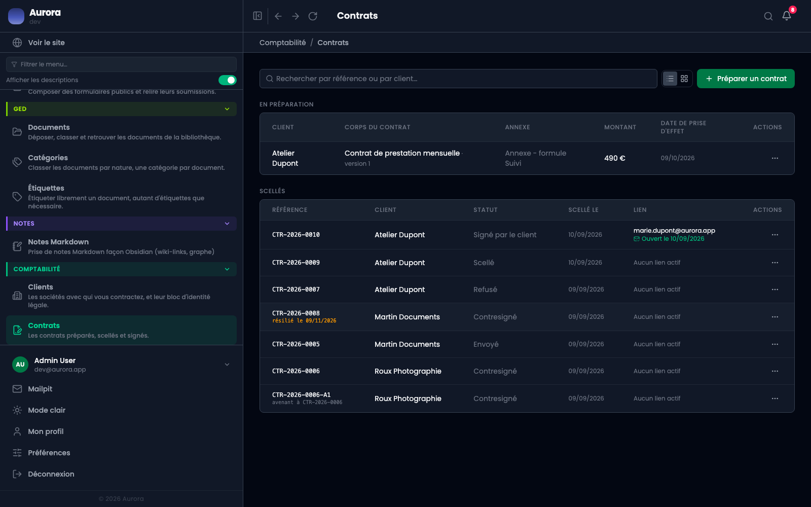
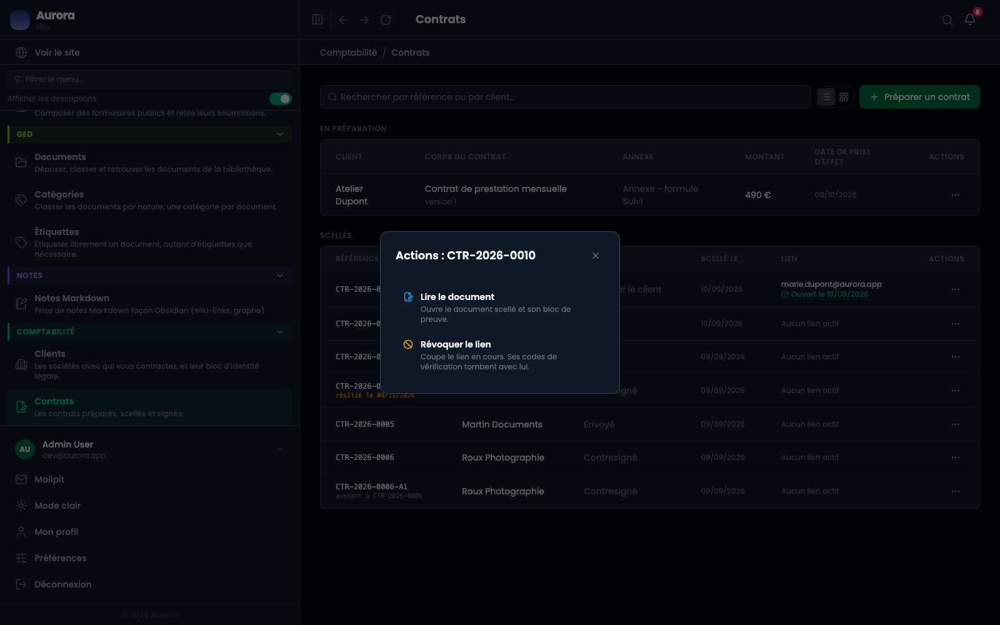
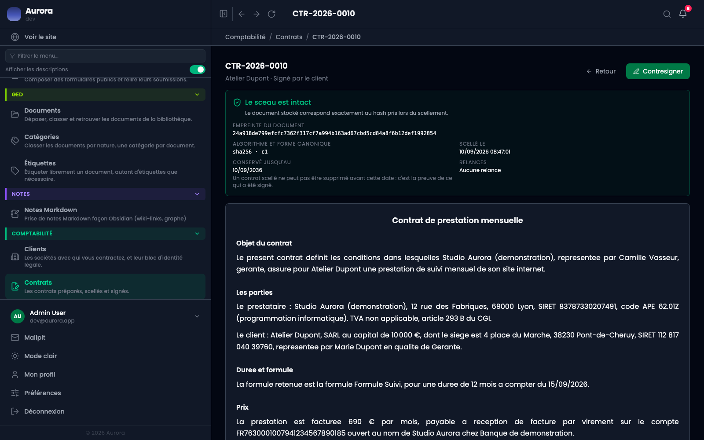
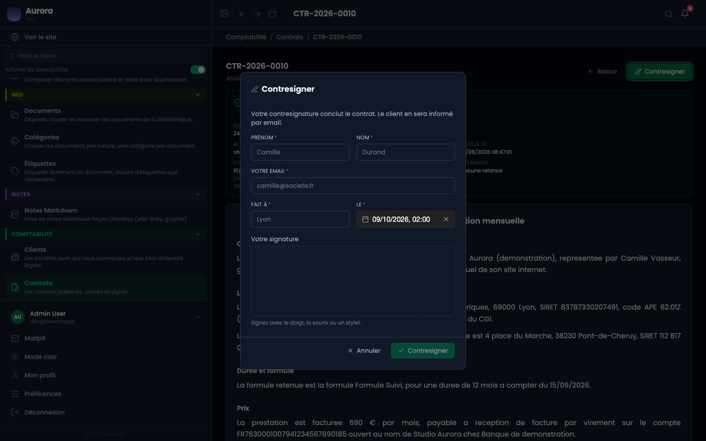
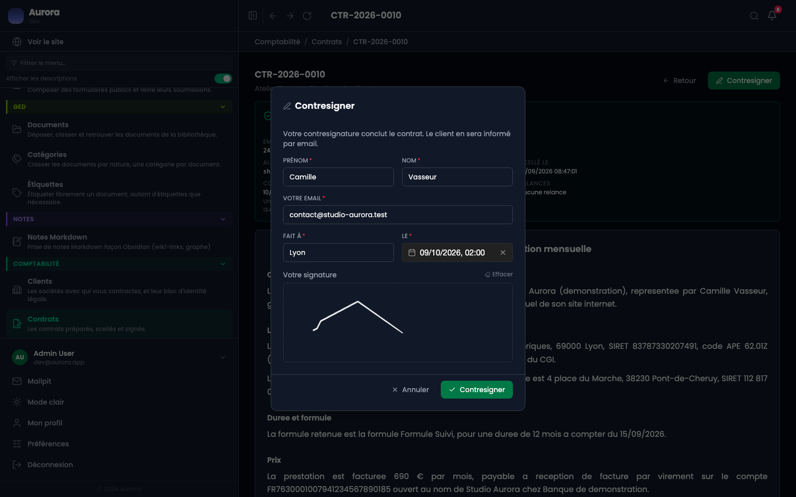
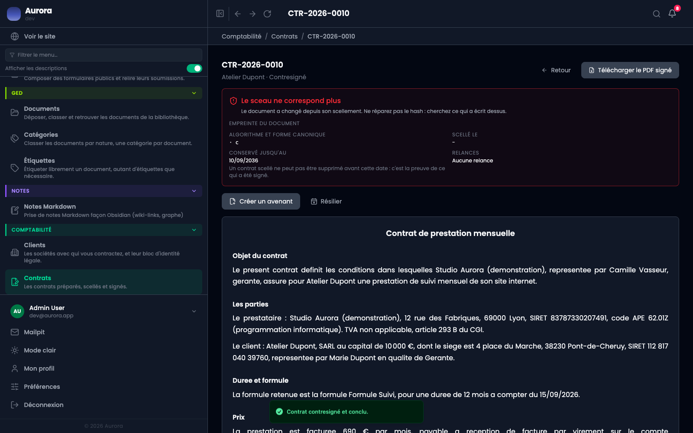

Le client a signé. Le contrat n'est pas conclu pour autant : il attend votre contresignature, qui est l'acte qui l'engage des deux côtés.

## 1. Le contrat revient signé

Son statut passe à « signé par le client » dans la liste, et la colonne du lien montre l'adresse et la date à laquelle il a été ouvert.

## 2. Le menu ne propose pas de contresigner

Volontairement. Depuis la liste, on ne peut que lire le document ou révoquer le lien. On ne conclut pas un contrat depuis une ligne de tableau.

## 3. La page du document

C'est là qu'est le bouton, en haut à droite, à côté du document qu'on va conclure. Le bloc de preuve rappelle l'empreinte, la date de scellement et la signature du client.

## 4. La fenêtre de contresignature

Elle demande la même chose qu'au client : identité, lieu, date, et un trait dans le cadre. Le prestataire signe comme le client signe, avec les mêmes preuves attachées.

La phrase du haut dit ce qui va se passer : la contresignature conclut le contrat, et le client en sera informé par e-mail.

## 5. Le contrat est conclu

Son statut devient « contresigné ». C'est l'état final : le contrat ne peut plus changer, et il ne peut plus être supprimé avant la fin de sa durée de conservation.

Le PDF signé est produit à ce moment-là, une seule fois, avec sa propre empreinte.

## Ce qui empêche de contresigner

- Un contrat que le client n'a pas encore signé : il n'y a rien à conclure.
- Un contrat refusé.
- Un contrat déjà contresigné : l'opération ne se rejoue pas.
