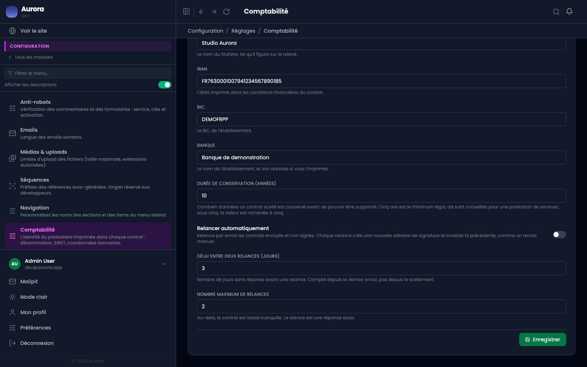

Un contrat scellé ne se supprime pas. Pas tout de suite : c'est la preuve de ce qui a été signé, et elle a une durée de vie réglée.

## Le réglage

Configuration → Réglages → Comptabilité, « durée de conservation ». Dix ans par défaut, conseillés pour une prestation de services.

**Cinq ans est un plancher** : une valeur inférieure est ramenée à cinq, parce que c'est le minimum légal et qu'un réglage ne doit pas permettre de passer dessous par distraction.

## Ce que la date fait

Chaque contrat affiche sa date de fin de conservation dans son bloc de preuve, calculée au scellement. Avant elle, la suppression est refusée.

## Une fois la durée écoulée

Rien ne se passe tout seul. La suppression redevient possible, elle ne devient pas automatique : supprimer une preuve est une décision, pas une conséquence.
