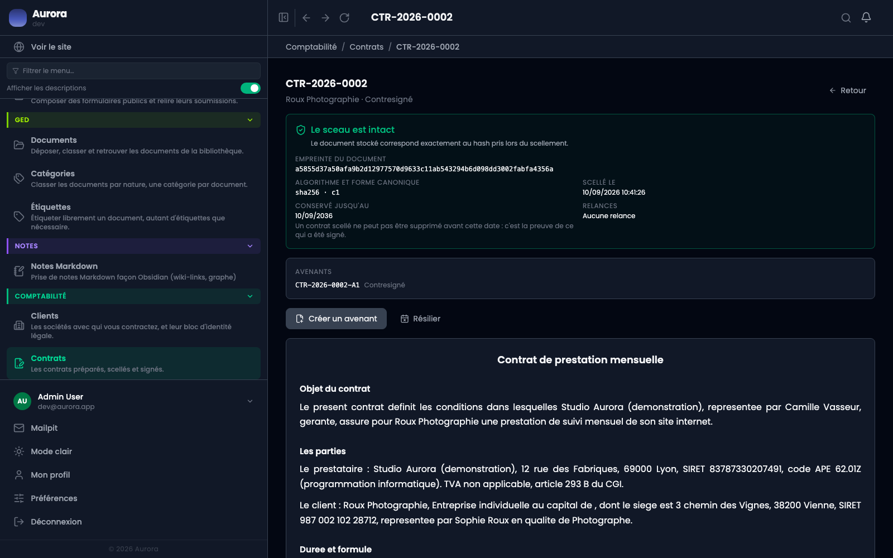

Chaque contrat scellé porte l'empreinte de son document. La vérification recalcule cette empreinte et la compare à celle qui a été prise.

## La commande

`aurora:contracts:verify`. Elle parcourt les contrats scellés, recalcule l'empreinte du document stocké sous la même forme canonique, et signale ceux qui divergent.

## Ce que ça vérifie vraiment

Que le document en base n'a pas changé depuis le scellement. Pas que le contrat est juste, ni qu'il a été signé : seulement que le texte est resté celui sur lequel les signatures portent.

## Si elle signale une dérive

- Ne réécrivez rien, et ne rescellez pas : ce serait effacer la trace.
- Regardez le journal d'audit à la date du contrat, il dira qui a touché à quoi.
- Une divergence vient soit d'une modification directe en base, soit d'une restauration partielle. Les deux se traitent par la sauvegarde, pas par l'application.

Le même contrôle tourne à chaque affichage d'un contrat, en plus petit : c'est ce que dit le bandeau « le sceau est intact ».

