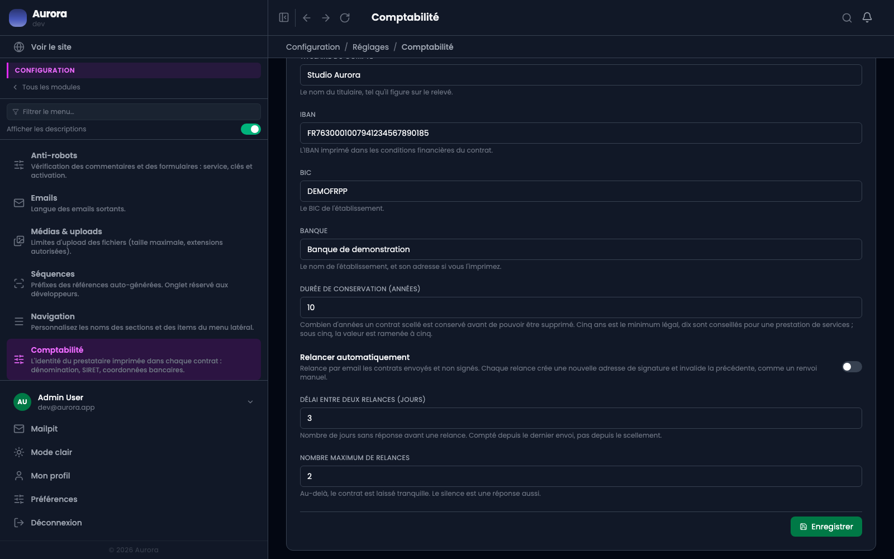

Votre propre identité ne vit pas dans une fiche client : elle est dans les réglages, et c'est de là que les jetons `provider.*` la tirent au moment de sceller.

## Où ça se règle

Configuration → Réglages → Comptabilité. L'onglet porte l'identité, les coordonnées bancaires, la durée de conservation et les relances.

## Les douze réglages

- Dénomination, représentant, adresse professionnelle.
- SIRET, code APE, mention de TVA.
- Email, téléphone.
- Titulaire du compte, IBAN, BIC, banque.

Chacun correspond à un jeton du même nom dans les trames.

## Pourquoi un seul vide bloque le scellement

Si une trame nomme `{{provider.iban}}` et que le réglage est vide, le contrat partirait avec un trou à l'endroit où le client doit virer l'argent. Le scellement refuse plutôt que de produire ce document.

Le refus ne dépend donc pas des douze réglages, mais de ceux que vos trames utilisent réellement.

## Ce qui change quand vous les modifiez

Rien, pour les contrats déjà scellés : ils portent la copie faite au scellement. Changer d'IBAN aujourd'hui ne réécrit aucun contrat signé, et c'est voulu.
